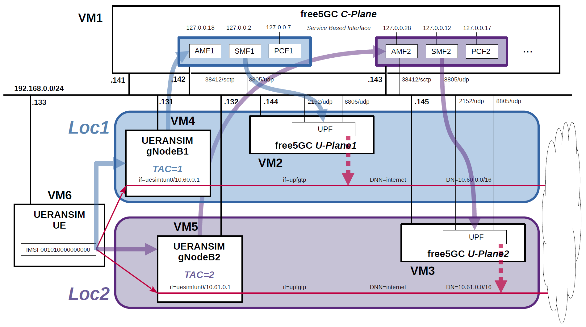

# free5GC 5GC & UERANSIM UE / RAN Sample Configuration - Select nearby UPF according to the connected gNodeB
This describes a very simple configuration that uses free5GC and UERANSIM to select the nearby UPF according to the connected gNodeB.

---

<h2 id="toc">Table of Contents</h2>

- [Overview of free5GC 5GC Simulation Mobile Network](#overview)
- [Changes in configuration files of free5GC 5GC and UERANSIM UE / RAN](#changes)
  - [Changes in configuration files of free5GC 5GC C-Plane](#changes_cp)
  - [Changes in configuration files of free5GC 5GC U-Plane1](#changes_up1)
  - [Changes in configuration files of free5GC 5GC U-Plane2](#changes_up2)
  - [Changes in configuration files of UERANSIM UE / RAN](#changes_ueransim)
    - [Changes in configuration files of RAN (gNodeB1)](#changes_ran1)
    - [Changes in configuration files of RAN (gNodeB2)](#changes_ran2)
    - [Changes in configuration files of UE for Loc1 (IMSI-001010000000000)](#changes_ue_loc1)
    - [Changes in configuration files of UE for Loc2 (IMSI-001010000000000)](#changes_ue_loc2)
- [Network settings of free5GC 5GC and UERANSIM UE / RAN](#network_settings)
  - [Network settings of free5GC 5GC C-Plane](#network_settings_cp)
  - [Network settings of free5GC 5GC U-Plane1](#network_settings_up1)
  - [Network settings of free5GC 5GC U-Plane2](#network_settings_up2)
- [Build free5GC and UERANSIM](#build)
- [Run free5GC 5GC and UERANSIM UE / RAN](#run)
  - [Run free5GC 5GC U-Plane1 & U-Plane2](#run_up)
  - [Run free5GC 5GC C-Plane](#run_cp)
  - [Run UERANSIM (gNodeBs)](#run_ran)
    - [Start gNodeB1 with TAC=1 in Loc1](#run_ran1)
    - [Start gNodeB2 with TAC=2 in Loc2](#run_ran2)
  - [Run UERANSIM (UE in Loc1)](#run_ue1)
    - [Start UE connected to gNodeB1 in Loc1](#con_ue1)
    - [Ping google.com going through DN=10.60.0.0/16 on Loc1](#ping_ue1)
  - [Run UERANSIM (UE in Loc2)](#run_ue2)
    - [Start UE connected to gNodeB2 in Loc2](#con_ue2)
    - [Ping google.com going through DN=10.61.0.0/16 on Loc2](#ping_ue2)
- [Changelog (summary)](#changelog)

---
<h2 id="overview">Overview of free5GC 5GC Simulation Mobile Network</h2>

The following minimum configuration was set as a condition.
- The pair of gNodeB and UPF exists in the same location.
- The UE connected to gNodeB connects to DN managed by UPF in the same location.

**In this example, TAC is matched to connect gNodeB and AMF, and AMF searches for SMF using `preferred target NF location` as one of the parameters.
Also, AMF and SMF search for PCF using `preferred target NF location` as one of the parameters.**

The built simulation environment is as follows.

</img>

The 5GC / UE / RAN used are as follows.
- 5GC - free5GC v3.1.0 - https://github.com/free5gc/free5gc
- UE / RAN - UERANSIM v3.2.6 - https://github.com/aligungr/UERANSIM

Each VMs are as follows.  
| VM # | SW & Role | IP address | OS | Memory (Min) | HDD (Min) |
| --- | --- | --- | --- | --- | --- |
| VM1 | free5GC  5GC C-Plane | 192.168.0.141/24 <br> 192.168.0.142/24 <br> 192.168.0.143/24 | Ubuntu 20.04 | 2GB | 20GB |
| VM2 | free5GC  5GC U-Plane1  | 192.168.0.144/24 | Ubuntu 20.04 | 1GB | 20GB |
| VM3 | free5GC  5GC U-Plane2  | 192.168.0.145/24 | Ubuntu 20.04 | 1GB | 20GB |
| VM4 | UERANSIM RAN (gNodeB1) | 192.168.0.131/24 | Ubuntu 20.04 | 1GB | 10GB |
| VM5 | UERANSIM RAN (gNodeB2) | 192.168.0.132/24 | Ubuntu 20.04 | 1GB | 10GB |
| VM6 | UERANSIM UE | 192.168.0.133/24 | Ubuntu 20.04 | 1GB | 10GB |

AMF & SMF addresses are as follows.  
| NF | IP address | IP address on SBI | Supported TACs | preferred target NF location |
| --- | --- | --- | --- | --- |
| AMF1 | 192.168.0.142 | 127.0.0.18 | 1 | loc1 |
| SMF1 | 192.168.0.142 | 127.0.0.2 | -- | loc1 |
| PCF1 | -- | 127.0.0.7 | -- | loc1 |
| AMF2 | 192.168.0.143 | 127.0.0.28 | 2 | loc2 |
| SMF2 | 192.168.0.143 | 127.0.0.12 | -- | loc2 |
| PCF2 | -- | 127.0.0.17 | -- | loc2 |

gNodeB Information (other information is default) is as follows.  
| gNodeB # | Location # | TAC # | IP address |
| --- | --- | --- | --- |
| gNodeB1 | Loc1 | 1 | 192.168.0.131 |
| gNodeB2 | Loc2 | 2 | 192.168.0.132 |

Subscriber Information (other information is default) is as follows.  
**Note. Please select OP or OPc according to the setting of UERANSIM UE configuration files.**
| UE | IMSI | DNN | OP/OPc | gNodeB # |
| --- | --- | --- | --- | --- |
| UE | 001010000000000 | internet | OPc | gNodeB1 in Loc1 <br> gNodeB2 in Loc2|

I registered these information with the free5GC WebUI.
In addition, [3GPP TS 35.208](https://www.3gpp.org/DynaReport/35208.htm) "4.3 Test Sets" is published by 3GPP as test data for the 3GPP authentication and key generation functions (MILENAGE).

Each DNs are as follows.
| DN | Location # |  TUNnel interface of DN | DNN | TUNnel interface of UE | U-Plane # |
| --- | --- | --- | --- | --- | --- |
| 10.60.0.0/16 | Loc1 | upfgtp | internet | uesimtun0 | U-Plane1 |
| 10.61.0.0/16 | Loc2 | upfgtp | internet | uesimtun0 | U-Plane2 |

<h2 id="changes">Changes in configuration files of free5GC 5GC and UERANSIM UE / RAN</h2>

Please refer to the following for building free5GC and UERANSIM respectively.
- free5GC v3.1.0 - https://github.com/free5gc/free5gc/wiki/Installation
- UERANSIM v3.2.6 - https://github.com/aligungr/UERANSIM/wiki/Installation

<h3 id="changes_cp">Changes in configuration files of free5GC 5GC C-Plane</h3>

- `free5gc/config/amfcfg1.yaml`
```diff
--- amfcfg.yaml.orig    2022-04-01 20:25:53.176313323 +0900
+++ amfcfg1.yaml        2022-04-03 22:17:29.059691038 +0900
@@ -5,7 +5,7 @@
 configuration:
   amfName: AMF # the name of this AMF
   ngapIpList:  # the IP list of N2 interfaces on this AMF
-    - 127.0.0.18
+    - 192.168.0.142
   sbi: # Service-based interface information
     scheme: http # the protocol for sbi (http or https)
     registerIPv4: 127.0.0.18 # IP used to register to NRF
@@ -23,23 +23,21 @@
   servedGuamiList: # Guami (Globally Unique AMF ID) list supported by this AMF
     # <GUAMI> = <MCC><MNC><AMF ID>
     - plmnId: # Public Land Mobile Network ID, <PLMN ID> = <MCC><MNC>
-        mcc: 208 # Mobile Country Code (3 digits string, digit: 0~9)
-        mnc: 93 # Mobile Network Code (2 or 3 digits string, digit: 0~9)
+        mcc: 001 # Mobile Country Code (3 digits string, digit: 0~9)
+        mnc: 01 # Mobile Network Code (2 or 3 digits string, digit: 0~9)
       amfId: cafe00 # AMF identifier (3 bytes hex string, range: 000000~FFFFFF)
   supportTaiList:  # the TAI (Tracking Area Identifier) list supported by this AMF
     - plmnId: # Public Land Mobile Network ID, <PLMN ID> = <MCC><MNC>
-        mcc: 208 # Mobile Country Code (3 digits string, digit: 0~9)
-        mnc: 93 # Mobile Network Code (2 or 3 digits string, digit: 0~9)
+        mcc: 001 # Mobile Country Code (3 digits string, digit: 0~9)
+        mnc: 01 # Mobile Network Code (2 or 3 digits string, digit: 0~9)
       tac: 1 # Tracking Area Code (uinteger, range: 0~16777215)
   plmnSupportList: # the PLMNs (Public land mobile network) list supported by this AMF
     - plmnId: # Public Land Mobile Network ID, <PLMN ID> = <MCC><MNC>
-        mcc: 208 # Mobile Country Code (3 digits string, digit: 0~9)
-        mnc: 93 # Mobile Network Code (2 or 3 digits string, digit: 0~9)
+        mcc: 001 # Mobile Country Code (3 digits string, digit: 0~9)
+        mnc: 01 # Mobile Network Code (2 or 3 digits string, digit: 0~9)
       snssaiList: # the S-NSSAI (Single Network Slice Selection Assistance Information) list supported by this AMF
         - sst: 1 # Slice/Service Type (uinteger, range: 0~255)
           sd: 010203 # Slice Differentiator (3 bytes hex string, range: 000000~FFFFFF)
-        - sst: 1 # Slice/Service Type (uinteger, range: 0~255)
-          sd: 112233 # Slice Differentiator (3 bytes hex string, range: 000000~FFFFFF)
   supportDnnList:  # the DNN (Data Network Name) list supported by this AMF
     - internet
   nrfUri: http://127.0.0.10:8000 # a valid URI of NRF
@@ -53,7 +51,7 @@
   networkName:  # the name of this core network
     full: free5GC
     short: free
-  locality: area1 # Name of the location where a set of AMF, SMF and UPFs are located
+  locality: loc1 # Name of the location where a set of AMF, SMF and UPFs are located
   networkFeatureSupport5GS: # 5gs Network Feature Support IE, refer to TS 24.501
     enable: true # append this IE in Registration accept or not
     length: 1 # IE content length (uinteger, range: 1~3)
```
- `free5gc/config/amfcfg2.yaml`
```diff
--- amfcfg.yaml.orig    2022-04-01 20:25:53.176313323 +0900
+++ amfcfg2.yaml        2022-04-03 22:17:38.501589902 +0900
@@ -5,11 +5,11 @@
 configuration:
   amfName: AMF # the name of this AMF
   ngapIpList:  # the IP list of N2 interfaces on this AMF
-    - 127.0.0.18
+    - 192.168.0.143
   sbi: # Service-based interface information
     scheme: http # the protocol for sbi (http or https)
-    registerIPv4: 127.0.0.18 # IP used to register to NRF
-    bindingIPv4: 127.0.0.18  # IP used to bind the service
+    registerIPv4: 127.0.0.28 # IP used to register to NRF
+    bindingIPv4: 127.0.0.28  # IP used to bind the service
     port: 8000 # port used to bind the service
     tls: # the local path of TLS key
       pem: config/TLS/amf.pem # AMF TLS Certificate
@@ -23,23 +23,21 @@
   servedGuamiList: # Guami (Globally Unique AMF ID) list supported by this AMF
     # <GUAMI> = <MCC><MNC><AMF ID>
     - plmnId: # Public Land Mobile Network ID, <PLMN ID> = <MCC><MNC>
-        mcc: 208 # Mobile Country Code (3 digits string, digit: 0~9)
-        mnc: 93 # Mobile Network Code (2 or 3 digits string, digit: 0~9)
+        mcc: 001 # Mobile Country Code (3 digits string, digit: 0~9)
+        mnc: 01 # Mobile Network Code (2 or 3 digits string, digit: 0~9)
       amfId: cafe00 # AMF identifier (3 bytes hex string, range: 000000~FFFFFF)
   supportTaiList:  # the TAI (Tracking Area Identifier) list supported by this AMF
     - plmnId: # Public Land Mobile Network ID, <PLMN ID> = <MCC><MNC>
-        mcc: 208 # Mobile Country Code (3 digits string, digit: 0~9)
-        mnc: 93 # Mobile Network Code (2 or 3 digits string, digit: 0~9)
-      tac: 1 # Tracking Area Code (uinteger, range: 0~16777215)
+        mcc: 001 # Mobile Country Code (3 digits string, digit: 0~9)
+        mnc: 01 # Mobile Network Code (2 or 3 digits string, digit: 0~9)
+      tac: 2 # Tracking Area Code (uinteger, range: 0~16777215)
   plmnSupportList: # the PLMNs (Public land mobile network) list supported by this AMF
     - plmnId: # Public Land Mobile Network ID, <PLMN ID> = <MCC><MNC>
-        mcc: 208 # Mobile Country Code (3 digits string, digit: 0~9)
-        mnc: 93 # Mobile Network Code (2 or 3 digits string, digit: 0~9)
+        mcc: 001 # Mobile Country Code (3 digits string, digit: 0~9)
+        mnc: 01 # Mobile Network Code (2 or 3 digits string, digit: 0~9)
       snssaiList: # the S-NSSAI (Single Network Slice Selection Assistance Information) list supported by this AMF
         - sst: 1 # Slice/Service Type (uinteger, range: 0~255)
           sd: 010203 # Slice Differentiator (3 bytes hex string, range: 000000~FFFFFF)
-        - sst: 1 # Slice/Service Type (uinteger, range: 0~255)
-          sd: 112233 # Slice Differentiator (3 bytes hex string, range: 000000~FFFFFF)
   supportDnnList:  # the DNN (Data Network Name) list supported by this AMF
     - internet
   nrfUri: http://127.0.0.10:8000 # a valid URI of NRF
@@ -53,7 +51,7 @@
   networkName:  # the name of this core network
     full: free5GC
     short: free
-  locality: area1 # Name of the location where a set of AMF, SMF and UPFs are located
+  locality: loc2 # Name of the location where a set of AMF, SMF and UPFs are located
   networkFeatureSupport5GS: # 5gs Network Feature Support IE, refer to TS 24.501
     enable: true # append this IE in Registration accept or not
     length: 1 # IE content length (uinteger, range: 1~3)
```
- `free5gc/config/smfcfg1.yaml`
```diff
--- smfcfg.yaml.orig    2022-04-01 20:25:53.177313344 +0900
+++ smfcfg1.yaml        2022-04-03 22:13:41.582022190 +0900
@@ -32,18 +32,18 @@
           dns: # the IP address of DNS
             ipv4: 8.8.8.8
   plmnList: # the list of PLMN IDs that this SMF belongs to (optional, remove this key when unnecessary)
-    - mcc: "208" # Mobile Country Code (3 digits string, digit: 0~9)
-      mnc: "93" # Mobile Network Code (2 or 3 digits string, digit: 0~9)
-  locality: area1 # Name of the location where a set of AMF, SMF and UPFs are located
+    - mcc: "001" # Mobile Country Code (3 digits string, digit: 0~9)
+      mnc: "01" # Mobile Network Code (2 or 3 digits string, digit: 0~9)
+  locality: loc1 # Name of the location where a set of AMF, SMF and UPFs are located
   pfcp: # the IP address of N4 interface on this SMF (PFCP)
-    addr: 127.0.0.1
+    addr: 192.168.0.142
   userplaneInformation: # list of userplane information
     upNodes: # information of userplane node (AN or UPF)
       gNB1: # the name of the node
         type: AN # the type of the node (AN or UPF)
       UPF:  # the name of the node
         type: UPF # the type of the node (AN or UPF)
-        nodeID: 127.0.0.8 # the IP/FQDN of N4 interface on this UPF (PFCP)
+        nodeID: 192.168.0.144 # the IP/FQDN of N4 interface on this UPF (PFCP)
         sNssaiUpfInfos: # S-NSSAI information list for this UPF
           - sNssai: # S-NSSAI (Single Network Slice Selection Assistance Information)
               sst: 1 # Slice/Service Type (uinteger, range: 0~255)
@@ -52,22 +52,16 @@
               - dnn: internet
                 pools:
                   - cidr: 10.60.0.0/16
-          - sNssai: # S-NSSAI (Single Network Slice Selection Assistance Information)
-              sst: 1 # Slice/Service Type (uinteger, range: 0~255)
-              sd: 112233 # Slice Differentiator (3 bytes hex string, range: 000000~FFFFFF)
-            dnnUpfInfoList: # DNN information list for this S-NSSAI
-              - dnn: internet
-                pools:
-                  - cidr: 10.61.0.0/16
         interfaces: # Interface list for this UPF
           - interfaceType: N3 # the type of the interface (N3 or N9)
             endpoints: # the IP address of this N3/N9 interface on this UPF
-              - 127.0.0.8
+              - 192.168.0.144
             networkInstance: internet # Data Network Name (DNN)
     links: # the topology graph of userplane, A and B represent the two nodes of each link
       - A: gNB1
         B: UPF
   nrfUri: http://127.0.0.10:8000 # a valid URI of NRF
+  ulcl: false
 
 # the kind of log output
 # debugLevel: how detailed to output, value: trace, debug, info, warn, error, fatal, panic
```
- `free5gc/config/smfcfg2.yaml`
```diff
--- smfcfg.yaml.orig    2022-04-01 20:25:53.177313344 +0900
+++ smfcfg2.yaml        2022-04-03 22:16:16.540556548 +0900
@@ -6,8 +6,8 @@
   smfName: SMF # the name of this SMF
   sbi: # Service-based interface information
     scheme: http # the protocol for sbi (http or https)
-    registerIPv4: 127.0.0.2 # IP used to register to NRF
-    bindingIPv4: 127.0.0.2  # IP used to bind the service
+    registerIPv4: 127.0.0.12 # IP used to register to NRF
+    bindingIPv4: 127.0.0.12  # IP used to bind the service
     port: 8000 # Port used to bind the service
     tls: # the local path of TLS key
       key: config/TLS/smf.key # SMF TLS Certificate
@@ -32,18 +32,18 @@
           dns: # the IP address of DNS
             ipv4: 8.8.8.8
   plmnList: # the list of PLMN IDs that this SMF belongs to (optional, remove this key when unnecessary)
-    - mcc: "208" # Mobile Country Code (3 digits string, digit: 0~9)
-      mnc: "93" # Mobile Network Code (2 or 3 digits string, digit: 0~9)
-  locality: area1 # Name of the location where a set of AMF, SMF and UPFs are located
+    - mcc: "001" # Mobile Country Code (3 digits string, digit: 0~9)
+      mnc: "01" # Mobile Network Code (2 or 3 digits string, digit: 0~9)
+  locality: loc2 # Name of the location where a set of AMF, SMF and UPFs are located
   pfcp: # the IP address of N4 interface on this SMF (PFCP)
-    addr: 127.0.0.1
+    addr: 192.168.0.143
   userplaneInformation: # list of userplane information
     upNodes: # information of userplane node (AN or UPF)
       gNB1: # the name of the node
         type: AN # the type of the node (AN or UPF)
       UPF:  # the name of the node
         type: UPF # the type of the node (AN or UPF)
-        nodeID: 127.0.0.8 # the IP/FQDN of N4 interface on this UPF (PFCP)
+        nodeID: 192.168.0.145 # the IP/FQDN of N4 interface on this UPF (PFCP)
         sNssaiUpfInfos: # S-NSSAI information list for this UPF
           - sNssai: # S-NSSAI (Single Network Slice Selection Assistance Information)
               sst: 1 # Slice/Service Type (uinteger, range: 0~255)
@@ -51,23 +51,17 @@
             dnnUpfInfoList: # DNN information list for this S-NSSAI
               - dnn: internet
                 pools:
-                  - cidr: 10.60.0.0/16
-          - sNssai: # S-NSSAI (Single Network Slice Selection Assistance Information)
-              sst: 1 # Slice/Service Type (uinteger, range: 0~255)
-              sd: 112233 # Slice Differentiator (3 bytes hex string, range: 000000~FFFFFF)
-            dnnUpfInfoList: # DNN information list for this S-NSSAI
-              - dnn: internet
-                pools:
                   - cidr: 10.61.0.0/16
         interfaces: # Interface list for this UPF
           - interfaceType: N3 # the type of the interface (N3 or N9)
             endpoints: # the IP address of this N3/N9 interface on this UPF
-              - 127.0.0.8
+              - 192.168.0.145
             networkInstance: internet # Data Network Name (DNN)
     links: # the topology graph of userplane, A and B represent the two nodes of each link
       - A: gNB1
         B: UPF
   nrfUri: http://127.0.0.10:8000 # a valid URI of NRF
+  ulcl: false
 
 # the kind of log output
 # debugLevel: how detailed to output, value: trace, debug, info, warn, error, fatal, panic
```
- `free5gc/config/pcfcfg1.yaml`
```diff
--- pcfcfg.yaml.orig    2022-04-03 19:31:43.524558018 +0900
+++ pcfcfg1.yaml        2022-04-03 22:20:00.252348433 +0900
@@ -27,7 +27,7 @@
   mongodb:       # the mongodb connected by this PCF
     name: free5gc                  # name of the mongodb
     url: mongodb://localhost:27017 # a valid URL of the mongodb
-  locality: area1 # Name of the location where a set of AMF, SMF, PCF and UPFs are located
+  locality: loc1 # Name of the location where a set of AMF, SMF, PCF and UPFs are located
 
 # the kind of log output
 # debugLevel: how detailed to output, value: trace, debug, info, warn, error, fatal, panic
```
- `free5gc/config/pcfcfg2.yaml`
```diff
--- pcfcfg.yaml.orig    2022-04-03 19:31:43.524558018 +0900
+++ pcfcfg2.yaml        2022-04-03 22:20:33.389124657 +0900
@@ -6,8 +6,8 @@
   pcfName: PCF # the name of this PCF
   sbi: # Service-based interface information
     scheme: http # the protocol for sbi (http or https)
-    registerIPv4: 127.0.0.7 # IP used to register to NRF
-    bindingIPv4: 127.0.0.7  # IP used to bind the service
+    registerIPv4: 127.0.0.17 # IP used to register to NRF
+    bindingIPv4: 127.0.0.17  # IP used to bind the service
     port: 8000              # port used to bind the service
     tls: # the local path of TLS key
       pem: config/TLS/pcf.pem # PCF TLS Certificate
@@ -27,7 +27,7 @@
   mongodb:       # the mongodb connected by this PCF
     name: free5gc                  # name of the mongodb
     url: mongodb://localhost:27017 # a valid URL of the mongodb
-  locality: area1 # Name of the location where a set of AMF, SMF, PCF and UPFs are located
+  locality: loc2 # Name of the location where a set of AMF, SMF, PCF and UPFs are located
 
 # the kind of log output
 # debugLevel: how detailed to output, value: trace, debug, info, warn, error, fatal, panic
```
- `free5gc/config/ausfcfg.yaml`
```diff
--- ausfcfg.yaml.orig   2022-04-01 20:25:53.176313323 +0900
+++ ausfcfg.yaml        2022-04-03 21:56:52.574055040 +0900
@@ -15,8 +15,8 @@
     - nausf-auth # Nausf_UEAuthentication service
   nrfUri: http://127.0.0.10:8000 # a valid URI of NRF
   plmnSupportList: # the PLMNs (Public Land Mobile Network) list supported by this AUSF
-    - mcc: 208 # Mobile Country Code (3 digits string, digit: 0~9)
-      mnc: 93  # Mobile Network Code (2 or 3 digits string, digit: 0~9)
+    - mcc: 001 # Mobile Country Code (3 digits string, digit: 0~9)
+      mnc: 01  # Mobile Network Code (2 or 3 digits string, digit: 0~9)
     - mcc: 123 # Mobile Country Code (3 digits string, digit: 0~9)
       mnc: 45  # Mobile Network Code (2 or 3 digits string, digit: 0~9)
   groupId: ausfGroup001 # ID for the group of the AUSF
```
- `free5gc/config/nrfcfg.yaml`
```diff
--- nrfcfg.yaml.orig    2022-04-01 20:25:53.177313344 +0900
+++ nrfcfg.yaml 2022-04-03 21:57:18.376344873 +0900
@@ -14,8 +14,8 @@
       pem: config/TLS/nrf.pem # NRF TLS Certificate
       key: config/TLS/nrf.key # NRF TLS Private key
   DefaultPlmnId:
-    mcc: 208 # Mobile Country Code (3 digits string, digit: 0~9)
-    mnc: 93 # Mobile Network Code (2 or 3 digits string, digit: 0~9)
+    mcc: 001 # Mobile Country Code (3 digits string, digit: 0~9)
+    mnc: 01 # Mobile Network Code (2 or 3 digits string, digit: 0~9)
   serviceNameList: # the SBI services provided by this NRF, refer to TS 29.510
     - nnrf-nfm # Nnrf_NFManagement service
     - nnrf-disc # Nnrf_NFDiscovery service
```
- `free5gc/config/nssfcfg.yaml`
```diff
--- nssfcfg.yaml.orig   2022-04-01 20:25:53.177313344 +0900
+++ nssfcfg.yaml        2022-04-03 21:58:01.240821301 +0900
@@ -17,12 +17,12 @@
     - nnssf-nssaiavailability # Nnssf_NSSAIAvailability service
   nrfUri: http://127.0.0.10:8000 # a valid URI of NRF
   supportedPlmnList: # the PLMNs (Public land mobile network) list supported by this NSSF
-    - mcc: 208 # Mobile Country Code (3 digits string, digit: 0~9)
-      mnc: 93 # Mobile Network Code (2 or 3 digits string, digit: 0~9)
+    - mcc: 001 # Mobile Country Code (3 digits string, digit: 0~9)
+      mnc: 01 # Mobile Network Code (2 or 3 digits string, digit: 0~9)
   supportedNssaiInPlmnList: # Supported S-NSSAI List for each PLMN
     - plmnId: # Public Land Mobile Network ID, <PLMN ID> = <MCC><MNC>
-        mcc: 208 # Mobile Country Code (3 digits string, digit: 0~9)
-        mnc: 93 # Mobile Network Code (2 or 3 digits string, digit: 0~9)
+        mcc: 001 # Mobile Country Code (3 digits string, digit: 0~9)
+        mnc: 01 # Mobile Network Code (2 or 3 digits string, digit: 0~9)
       supportedSnssaiList: # Supported S-NSSAIs of the PLMN
         - sst: 1 # Slice/Service Type (uinteger, range: 0~255)
           sd: 010203 # Slice Differentiator (3 bytes hex string, range: 000000~FFFFFF)
```

<h3 id="changes_up1">Changes in configuration files of free5GC 5GC U-Plane1</h3>

- `free5gc/NFs/upf/build/config/upfcfg.yaml`
```diff
--- upfcfg.yaml.orig    2022-04-01 20:34:11.333681494 +0900
+++ upfcfg.yaml 2022-04-04 19:19:37.727287999 +0900
@@ -15,12 +15,12 @@
 
   # The IP list of the N4 interface on this UPF (Can't set to 0.0.0.0)
   pfcp:
-    - addr: 127.0.0.8
+    - addr: 192.168.0.144
 
   # The IP list of the N3/N9 interfaces on this UPF
   # If there are multiple connection, set addr to 0.0.0.0 or list all the addresses
   gtpu:
-    - addr: 127.0.0.8
+    - addr: 192.168.0.144
     # [optional] gtpu.name
     # - name: upf.5gc.nctu.me
     # [optional] gtpu.ifname
```

<h3 id="changes_up2">Changes in configuration files of free5GC 5GC U-Plane2</h3>

- `free5gc/NFs/upf/build/config/upfcfg.yaml`
```diff
--- upfcfg.yaml.orig    2022-04-01 20:36:05.833367506 +0900
+++ upfcfg.yaml 2022-04-04 19:20:52.602601166 +0900
@@ -15,12 +15,12 @@
 
   # The IP list of the N4 interface on this UPF (Can't set to 0.0.0.0)
   pfcp:
-    - addr: 127.0.0.8
+    - addr: 192.168.0.145
 
   # The IP list of the N3/N9 interfaces on this UPF
   # If there are multiple connection, set addr to 0.0.0.0 or list all the addresses
   gtpu:
-    - addr: 127.0.0.8
+    - addr: 192.168.0.145
     # [optional] gtpu.name
     # - name: upf.5gc.nctu.me
     # [optional] gtpu.ifname
@@ -29,6 +29,6 @@
   # The DNN list supported by UPF
   dnn_list:
     - dnn: internet # Data Network Name
-      cidr: 10.60.0.0/16 # Classless Inter-Domain Routing for assigned IPv4 pool of UE
+      cidr: 10.61.0.0/16 # Classless Inter-Domain Routing for assigned IPv4 pool of UE
       # [optional] dnn_list[*].natifname
       # natifname: eth0
```

<h3 id="changes_ueransim">Changes in configuration files of UERANSIM UE / RAN</h3>

<h4 id="changes_ran1">Changes in configuration files of RAN (gNodeB1)</h4>

- `UERANSIM/config/free5gc-gnb.yaml`
```diff
--- free5gc-gnb.yaml.orig       2021-02-11 11:03:28.000000000 +0000
+++ free5gc-gnb.yaml    2021-08-10 00:28:30.000000000 +0000
@@ -1,17 +1,17 @@
-mcc: '208'          # Mobile Country Code value
-mnc: '93'           # Mobile Network Code value (2 or 3 digits)
+mcc: '001'          # Mobile Country Code value
+mnc: '01'           # Mobile Network Code value (2 or 3 digits)
 
 nci: '0x000000010'  # NR Cell Identity (36-bit)
 idLength: 32        # NR gNB ID length in bits [22...32]
 tac: 1              # Tracking Area Code
 
-linkIp: 127.0.0.1   # gNB's local IP address for Radio Link Simulation (Usually same with local IP)
-ngapIp: 127.0.0.1   # gNB's local IP address for N2 Interface (Usually same with local IP)
-gtpIp: 127.0.0.1    # gNB's local IP address for N3 Interface (Usually same with local IP)
+linkIp: 192.168.0.131   # gNB's local IP address for Radio Link Simulation (Usually same with local IP)
+ngapIp: 192.168.0.131   # gNB's local IP address for N2 Interface (Usually same with local IP)
+gtpIp: 192.168.0.131    # gNB's local IP address for N3 Interface (Usually same with local IP)
 
 # List of AMF address information
 amfConfigs:
-  - address: 127.0.0.1
+  - address: 192.168.0.142
     port: 38412
 
 # List of supported S-NSSAIs by this gNB
```

<h4 id="changes_ran2">Changes in configuration files of RAN (gNodeB2)</h4>

- `UERANSIM/config/free5gc-gnb.yaml`
```diff
--- free5gc-gnb.yaml.orig       2021-02-11 11:03:28.000000000 +0000
+++ free5gc-gnb.yaml    2021-08-10 00:30:54.000000000 +0000
@@ -1,17 +1,17 @@
-mcc: '208'          # Mobile Country Code value
-mnc: '93'           # Mobile Network Code value (2 or 3 digits)
+mcc: '001'          # Mobile Country Code value
+mnc: '01'           # Mobile Network Code value (2 or 3 digits)
 
 nci: '0x000000010'  # NR Cell Identity (36-bit)
 idLength: 32        # NR gNB ID length in bits [22...32]
-tac: 1              # Tracking Area Code
+tac: 2              # Tracking Area Code
 
-linkIp: 127.0.0.1   # gNB's local IP address for Radio Link Simulation (Usually same with local IP)
-ngapIp: 127.0.0.1   # gNB's local IP address for N2 Interface (Usually same with local IP)
-gtpIp: 127.0.0.1    # gNB's local IP address for N3 Interface (Usually same with local IP)
+linkIp: 192.168.0.132   # gNB's local IP address for Radio Link Simulation (Usually same with local IP)
+ngapIp: 192.168.0.132   # gNB's local IP address for N2 Interface (Usually same with local IP)
+gtpIp: 192.168.0.132    # gNB's local IP address for N3 Interface (Usually same with local IP)
 
 # List of AMF address information
 amfConfigs:
-  - address: 127.0.0.1
+  - address: 192.168.0.143
     port: 38412
 
 # List of supported S-NSSAIs by this gNB
```

<h4 id="changes_ue_loc1">Changes in configuration files of UE for Loc1 (IMSI-001010000000000)</h4>

- `UERANSIM/config/free5gc-ue-loc1.yaml`
```diff
--- free5gc-ue.yaml.orig        2021-09-18 21:11:52.000000000 +0900
+++ free5gc-ue-loc1.yaml        2022-04-04 19:33:36.993974680 +0900
@@ -1,9 +1,9 @@
 # IMSI number of the UE. IMSI = [MCC|MNC|MSISDN] (In total 15 digits)
-supi: 'imsi-208930000000003'
+supi: 'imsi-001010000000000'
 # Mobile Country Code value of HPLMN
-mcc: '208'
+mcc: '001'
 # Mobile Network Code value of HPLMN (2 or 3 digits)
-mnc: '93'
+mnc: '01'
 
 # Permanent subscription key
 key: '8baf473f2f8fd09487cccbd7097c6862'
@@ -20,7 +20,7 @@
 
 # List of gNB IP addresses for Radio Link Simulation
 gnbSearchList:
-  - 127.0.0.1
+  - 192.168.0.131
 
 # UAC Access Identities Configuration
 uacAic:
```

<h4 id="changes_ue_loc2">Changes in configuration files of UE for Loc2 (IMSI-001010000000000)</h4>

- `UERANSIM/config/free5gc-ue-loc2.yaml`
```diff
--- free5gc-ue.yaml.orig        2021-09-18 21:11:52.000000000 +0900
+++ free5gc-ue-loc2.yaml        2022-04-04 19:34:35.676208193 +0900
@@ -1,9 +1,9 @@
 # IMSI number of the UE. IMSI = [MCC|MNC|MSISDN] (In total 15 digits)
-supi: 'imsi-208930000000003'
+supi: 'imsi-001010000000000'
 # Mobile Country Code value of HPLMN
-mcc: '208'
+mcc: '001'
 # Mobile Network Code value of HPLMN (2 or 3 digits)
-mnc: '93'
+mnc: '01'
 
 # Permanent subscription key
 key: '8baf473f2f8fd09487cccbd7097c6862'
@@ -20,7 +20,7 @@
 
 # List of gNB IP addresses for Radio Link Simulation
 gnbSearchList:
-  - 127.0.0.1
+  - 192.168.0.132
 
 # UAC Access Identities Configuration
 uacAic:
```

<h2 id="network_settings">Network settings of free5GC 5GC and UERANSIM UE / RAN</h2>

<h3 id="network_settings_cp">Network settings of free5GC 5GC C-Plane</h3>

Add IP addresses for (AMF1 & SMF1 & PCF1) and (AMF2 & SMF2 & PCF2).
```
ip addr add 192.168.0.142/24 dev enp0s8
ip addr add 192.168.0.143/24 dev enp0s8
```
**Note. `enp0s8` is the network interface of `192.168.0.0/24` in my VirtualBox environment.
Please change it according to your environment.**

<h3 id="network_settings_up1">Network settings of free5GC 5GC U-Plane1</h3>

First, uncomment the next line in the `/etc/sysctl.conf` file and reflect it in the OS.
```
net.ipv4.ip_forward=1
```
```
# sysctl -p
```
Next, configure NAPT.
```
# iptables -t nat -A POSTROUTING -s 10.60.0.0/16 ! -o upfgtp -j MASQUERADE
```

<h3 id="network_settings_up2">Network settings of free5GC 5GC U-Plane2</h3>

First, uncomment the next line in the `/etc/sysctl.conf` file and reflect it in the OS.
```
net.ipv4.ip_forward=1
```
```
# sysctl -p
```
Next, configure NAPT.
```
# iptables -t nat -A POSTROUTING -s 10.61.0.0/16 ! -o upfgtp -j MASQUERADE
```

<h2 id="build">Build free5GC and UERANSIM</h2>

Please refer to the following for building free5GC and UERANSIM respectively.
- free5GC v3.1.0 - https://github.com/free5gc/free5gc/wiki/Installation
- UERANSIM v3.2.6 - https://github.com/aligungr/UERANSIM/wiki/Installation

Note. Install MongoDB with package manager on free5GC 5GC C-Plane machine.
[MongoDB Compass](https://www.mongodb.com/products/compass) is a convenient tool to look at the MongoDB database.
```
# apt update
# apt install mongodb
# systemctl start mongodb
# systemctl enable mongodb
```
It is not necessary to install MongoDB on free5GC 5GC U-Plane machines.

**Note. If you want to use the latest committed version, please run the following script to checkout all NFs and Web Console to the latest `main` branch before building.**
```
#!/usr/bin/env bash

NF_LIST="nrf amf smf udr pcf udm nssf ausf upf n3iwf"

for NF in ${NF_LIST}; do
    cd NFs/${NF}
    git checkout main
    cd ../..
done

cd webconsole
git checkout main

cd ..
git checkout main
```

<h2 id="run">Run free5GC 5GC and UERANSIM UE / RAN</h2>

First run the 5GC, then UERANSIM (UE & RAN implementation).

<h3 id="run_up">Run free5GC 5GC U-Plane1 & U-Plane2</h3>

First, run free5GC 5GC U-Planes. Please see [here](https://github.com/free5gc/free5gc/issues/170#issuecomment-773214169) for the reason.

- free5GC 5GC U-Plane1
```
# cd free5gc/NFs/upf/build
# bin/free5gc-upfd
```
- free5GC 5GC U-Plane2
```
# cd free5gc/NFs/upf/build
# bin/free5gc-upfd
```
Then run `tcpdump` on one more terminal for each U-Plane.
- Run `tcpdump` on VM2 (U-Plane1)
```
# tcpdump -i upfgtp -n
tcpdump: verbose output suppressed, use -v or -vv for full protocol decode
listening on upfgtp, link-type RAW (Raw IP), capture size 262144 bytes
```
- Run `tcpdump` on VM3 (U-Plane2)
```
# tcpdump -i upfgtp -n
tcpdump: verbose output suppressed, use -v or -vv for full protocol decode
listening on upfgtp, link-type RAW (Raw IP), capture size 262144 bytes
```

<h3 id="run_cp">Run free5GC 5GC C-Plane</h3>

Next, run free5GC 5GC C-Plane.

- free5GC 5GC C-Plane

Create the following shell script and run it.
```
#!/usr/bin/env bash

PID_LIST=()

NF_LIST1="amf smf pcf"
NF_LIST2="udr udm nssf ausf"

export GIN_MODE=release

./bin/nrf &
PID_LIST+=($!)
sleep 1

for NF in ${NF_LIST1}; do
    ./bin/${NF} -c config/${NF}cfg1.yaml &
    PID_LIST+=($!)
    sleep 1
    ./bin/${NF} -c config/${NF}cfg2.yaml &
    PID_LIST+=($!)
    sleep 1
done

for NF in ${NF_LIST2}; do
    ./bin/${NF} &
    PID_LIST+=($!)
    sleep 1
done

function terminate()
{
    sudo kill -SIGTERM ${PID_LIST[${#PID_LIST[@]}-2]} ${PID_LIST[${#PID_LIST[@]}-1]}
    sleep 2
}

trap terminate SIGINT
wait ${PID_LIST}
```

<h3 id="run_ran">Run UERANSIM (gNodeBs)</h3>

Run each gNodeB with TAC=1 and TAC=2 in two locations.  
Please refer to the following for usage of UERANSIM.

https://github.com/aligungr/UERANSIM/wiki/Usage

<h4 id="run_ran1">Start gNodeB1 with TAC=1 in Loc1</h4>

```
# ./nr-gnb -c ../config/free5gc-gnb.yaml
UERANSIM v3.2.6
[2022-04-04 20:40:03.328] [sctp] [info] Trying to establish SCTP connection... (192.168.0.142:38412)
[2022-04-04 20:40:03.331] [sctp] [info] SCTP connection established (192.168.0.142:38412)
[2022-04-04 20:40:03.331] [sctp] [debug] SCTP association setup ascId[5]
[2022-04-04 20:40:03.331] [ngap] [debug] Sending NG Setup Request
[2022-04-04 20:40:03.334] [ngap] [debug] NG Setup Response received
[2022-04-04 20:40:03.334] [ngap] [info] NG Setup procedure is successful
```
The free5GC C-Plane log when executed is as follows.
```
2022-04-04T20:40:03+09:00 [INFO][AMF][NGAP] [AMF] SCTP Accept from: 192.168.0.131:44411
2022-04-04T20:40:03+09:00 [INFO][AMF][NGAP] Create a new NG connection for: 192.168.0.131:44411
2022-04-04T20:40:03+09:00 [INFO][AMF][NGAP][192.168.0.131:44411] Handle NG Setup request
2022-04-04T20:40:03+09:00 [INFO][AMF][NGAP][192.168.0.131:44411] Send NG-Setup response
```

<h4 id="run_ran2">Start gNodeB2 with TAC=2 in Loc2</h4>

```
# ./nr-gnb -c ../config/free5gc-gnb.yaml
UERANSIM v3.2.6
[2022-04-04 20:41:05.669] [sctp] [info] Trying to establish SCTP connection... (192.168.0.143:38412)
[2022-04-04 20:41:05.672] [sctp] [info] SCTP connection established (192.168.0.143:38412)
[2022-04-04 20:41:05.672] [sctp] [debug] SCTP association setup ascId[5]
[2022-04-04 20:41:05.672] [ngap] [debug] Sending NG Setup Request
[2022-04-04 20:41:05.675] [ngap] [debug] NG Setup Response received
[2022-04-04 20:41:05.675] [ngap] [info] NG Setup procedure is successful
```
The free5GC C-Plane log when executed is as follows.
```
2022-04-04T20:41:05+09:00 [INFO][AMF][NGAP] [AMF] SCTP Accept from: 192.168.0.132:41632
2022-04-04T20:41:05+09:00 [INFO][AMF][NGAP] Create a new NG connection for: 192.168.0.132:41632
2022-04-04T20:41:05+09:00 [INFO][AMF][NGAP][192.168.0.132:41632] Handle NG Setup request
2022-04-04T20:41:05+09:00 [INFO][AMF][NGAP][192.168.0.132:41632] Send NG-Setup response
```

<h3 id="run_ue1">Run UERANSIM (UE in Loc1)</h3>

Confirm that the packet goes through the DN of U-Plane1 in the same Loc1 by connecting to gNodeB1 in Loc1.

<h4 id="con_ue1">Start UE connected to gNodeB1 in Loc1</h4>

```
# ./nr-ue -c ../config/free5gc-ue-loc1.yaml 
UERANSIM v3.2.6
[2022-04-04 20:44:07.561] [nas] [info] UE switches to state [MM-DEREGISTERED/PLMN-SEARCH]
[2022-04-04 20:44:07.561] [rrc] [debug] New signal detected for cell[1], total [1] cells in coverage
[2022-04-04 20:44:07.562] [nas] [info] Selected plmn[001/01]
[2022-04-04 20:44:07.562] [rrc] [info] Selected cell plmn[001/01] tac[1] category[SUITABLE]
[2022-04-04 20:44:07.563] [nas] [info] UE switches to state [MM-DEREGISTERED/PS]
[2022-04-04 20:44:07.563] [nas] [info] UE switches to state [MM-DEREGISTERED/NORMAL-SERVICE]
[2022-04-04 20:44:07.563] [nas] [debug] Initial registration required due to [MM-DEREG-NORMAL-SERVICE]
[2022-04-04 20:44:07.565] [nas] [debug] UAC access attempt is allowed for identity[0], category[MO_sig]
[2022-04-04 20:44:07.565] [nas] [debug] Sending Initial Registration
[2022-04-04 20:44:07.565] [rrc] [debug] Sending RRC Setup Request
[2022-04-04 20:44:07.566] [nas] [info] UE switches to state [MM-REGISTER-INITIATED]
[2022-04-04 20:44:07.567] [rrc] [info] RRC connection established
[2022-04-04 20:44:07.567] [rrc] [info] UE switches to state [RRC-CONNECTED]
[2022-04-04 20:44:07.567] [nas] [info] UE switches to state [CM-CONNECTED]
[2022-04-04 20:44:07.591] [nas] [debug] Authentication Request received
[2022-04-04 20:44:07.599] [nas] [debug] Security Mode Command received
[2022-04-04 20:44:07.599] [nas] [debug] Selected integrity[2] ciphering[0]
[2022-04-04 20:44:07.640] [nas] [debug] Registration accept received
[2022-04-04 20:44:07.641] [nas] [info] UE switches to state [MM-REGISTERED/NORMAL-SERVICE]
[2022-04-04 20:44:07.641] [nas] [debug] Sending Registration Complete
[2022-04-04 20:44:07.641] [nas] [info] Initial Registration is successful
[2022-04-04 20:44:07.642] [nas] [debug] Sending PDU Session Establishment Request
[2022-04-04 20:44:07.642] [nas] [debug] UAC access attempt is allowed for identity[0], category[MO_sig]
[2022-04-04 20:44:07.898] [nas] [debug] PDU Session Establishment Accept received
[2022-04-04 20:44:07.901] [nas] [info] PDU Session establishment is successful PSI[1]
[2022-04-04 20:44:07.923] [app] [info] Connection setup for PDU session[1] is successful, TUN interface[uesimtun0, 10.60.0.1] is up.
```
The free5GC C-Plane log when executed is as follows.
```
2022-04-04T20:44:07+09:00 [INFO][AMF][NGAP][192.168.0.131:37522] Handle Initial UE Message
2022-04-04T20:44:07+09:00 [INFO][LIB][FSM] Handle event[Gmm Message], transition from [Deregistered] to [Deregistered]
2022-04-04T20:44:07+09:00 [INFO][AMF][GMM][AMF_UE_NGAP_ID:1] Handle Registration Request
2022-04-04T20:44:07+09:00 [INFO][LIB][FSM] Handle event[Start Authentication], transition from [Deregistered] to [Authentication]
2022-04-04T20:44:07+09:00 [INFO][AMF][GMM][AMF_UE_NGAP_ID:1] Authentication procedure
2022-04-04T20:44:07+09:00 [INFO][NRF][DSCV] Handle NFDiscoveryRequest
2022-04-04T20:44:07+09:00 [INFO][NRF][GIN] | 200 |       127.0.0.1 | GET     | /nnrf-disc/v1/nf-instances?requester-nf-type=AMF&target-nf-type=AUSF |
2022-04-04T20:44:07+09:00 [INFO][AUSF][UeAuthPost] HandleUeAuthPostRequest
2022-04-04T20:44:07+09:00 [INFO][AUSF][UeAuthPost] Serving network authorized
2022-04-04T20:44:07+09:00 [INFO][NRF][DSCV] Handle NFDiscoveryRequest
2022-04-04T20:44:07+09:00 [INFO][NRF][GIN] | 200 |       127.0.0.1 | GET     | /nnrf-disc/v1/nf-instances?requester-nf-type=AUSF&service-names=nudm-ueau&target-nf-type=UDM |
2022-04-04T20:44:07+09:00 [INFO][UDM][UEAU] Handle GenerateAuthDataRequest
2022-04-04T20:44:07+09:00 [INFO][UDM][Suci] suciPart: [suci 0 001 01 0000 0 0 0000000000]
2022-04-04T20:44:07+09:00 [INFO][UDM][Suci] scheme 0
2022-04-04T20:44:07+09:00 [INFO][UDM][Suci] SUPI type is IMSI
http://127.0.0.10:8000
2022-04-04T20:44:07+09:00 [INFO][NRF][DSCV] Handle NFDiscoveryRequest
2022-04-04T20:44:07+09:00 [INFO][NRF][GIN] | 200 |       127.0.0.1 | GET     | /nnrf-disc/v1/nf-instances?requester-nf-type=UDM&target-nf-type=UDR |
2022-04-04T20:44:07+09:00 [INFO][UDR][DRepo] Handle QueryAuthSubsData
2022-04-04T20:44:07+09:00 [INFO][UDR][GIN] | 200 |       127.0.0.1 | GET     | /nudr-dr/v1/subscription-data/imsi-001010000000000/authentication-data/authentication-subscription |
2022-04-04T20:44:07+09:00 [ERRO][UDM][UEAU] opStr length is  0
2022-04-04T20:44:07+09:00 [INFO][UDR][DRepo] Handle ModifyAuthentication
2022-04-04T20:44:07+09:00 [INFO][UDR][GIN] | 204 |       127.0.0.1 | PATCH   | /nudr-dr/v1/subscription-data/imsi-001010000000000/authentication-data/authentication-subscription |
2022-04-04T20:44:07+09:00 [INFO][UDM][GIN] | 200 |       127.0.0.1 | POST    | /nudm-ueau/v1/suci-0-001-01-0000-0-0-0000000000/security-information/generate-auth-data |
2022-04-04T20:44:07+09:00 [INFO][AUSF][UeAuthPost] Add SuciSupiPair (suci-0-001-01-0000-0-0-0000000000, imsi-001010000000000) to map.
2022-04-04T20:44:07+09:00 [INFO][AUSF][UeAuthPost] Use 5G AKA auth method
2022-04-04T20:44:07+09:00 [INFO][AUSF][5gAkaAuth] XresStar = 3532373162633362396233366339383565633963626133303833303838643336
2022-04-04T20:44:07+09:00 [INFO][AUSF][GIN] | 201 |       127.0.0.1 | POST    | /nausf-auth/v1/ue-authentications |
2022-04-04T20:44:07+09:00 [INFO][AMF][GMM][AMF_UE_NGAP_ID:1] Send Authentication Request
2022-04-04T20:44:07+09:00 [INFO][AMF][NGAP][192.168.0.131:37522][AMF_UE_NGAP_ID:1] Send Downlink Nas Transport
2022-04-04T20:44:07+09:00 [INFO][AMF][NGAP][192.168.0.131:37522][AMF_UE_NGAP_ID:1] Uplink NAS Transport (RAN UE NGAP ID: 1)
2022-04-04T20:44:07+09:00 [INFO][LIB][FSM] Handle event[Gmm Message], transition from [Authentication] to [Authentication]
2022-04-04T20:44:07+09:00 [INFO][AMF][GMM][AMF_UE_NGAP_ID:1] Handle Authentication Response
2022-04-04T20:44:07+09:00 [INFO][AUSF][5gAkaAuth] Auth5gAkaComfirmRequest
2022-04-04T20:44:07+09:00 [INFO][AUSF][5gAkaAuth] res*: 3532373162633362396233366339383565633963626133303833303838643336
Xres*: 3532373162633362396233366339383565633963626133303833303838643336
2022-04-04T20:44:07+09:00 [INFO][AUSF][5gAkaAuth] 5G AKA confirmation succeeded
2022-04-04T20:44:07+09:00 [INFO][UDM][UEAU] Handle ConfirmAuthDataRequest
2022-04-04T20:44:07+09:00 [INFO][UDR][DRepo] Handle CreateAuthenticationStatus
2022-04-04T20:44:07+09:00 [INFO][UDR][GIN] | 204 |       127.0.0.1 | PUT     | /nudr-dr/v1/subscription-data/imsi-001010000000000/authentication-data/authentication-status |
2022-04-04T20:44:07+09:00 [INFO][UDM][GIN] | 201 |       127.0.0.1 | POST    | /nudm-ueau/v1/imsi-001010000000000/auth-events |
2022-04-04T20:44:07+09:00 [INFO][AUSF][GIN] | 200 |       127.0.0.1 | PUT     | /nausf-auth/v1/ue-authentications/suci-0-001-01-0000-0-0-0000000000/5g-aka-confirmation |
2022-04-04T20:44:07+09:00 [INFO][LIB][FSM] Handle event[Authentication Success], transition from [Authentication] to [SecurityMode]
2022-04-04T20:44:07+09:00 [INFO][AMF][GMM][AMF_UE_NGAP_ID:1][SUPI:imsi-001010000000000] Send Security Mode Command
2022-04-04T20:44:07+09:00 [INFO][AMF][NGAP][192.168.0.131:37522][AMF_UE_NGAP_ID:1] Send Downlink Nas Transport
2022-04-04T20:44:07+09:00 [INFO][AMF][NGAP][192.168.0.131:37522][AMF_UE_NGAP_ID:1] Uplink NAS Transport (RAN UE NGAP ID: 1)
2022-04-04T20:44:07+09:00 [INFO][LIB][FSM] Handle event[Gmm Message], transition from [SecurityMode] to [SecurityMode]
2022-04-04T20:44:07+09:00 [INFO][AMF][GMM][AMF_UE_NGAP_ID:1][SUPI:imsi-001010000000000] Handle Security Mode Complete
2022-04-04T20:44:07+09:00 [INFO][LIB][FSM] Handle event[SecurityMode Success], transition from [SecurityMode] to [ContextSetup]
2022-04-04T20:44:07+09:00 [INFO][AMF][GMM][AMF_UE_NGAP_ID:1][SUPI:imsi-001010000000000] Handle InitialRegistration
2022-04-04T20:44:07+09:00 [INFO][NRF][DSCV] Handle NFDiscoveryRequest
2022-04-04T20:44:07+09:00 [INFO][NRF][GIN] | 200 |       127.0.0.1 | GET     | /nnrf-disc/v1/nf-instances?requester-nf-type=AMF&supi=imsi-001010000000000&target-nf-type=UDM |
2022-04-04T20:44:07+09:00 [INFO][UDM][SDM] Handle GetNssai
2022-04-04T20:44:07+09:00 [INFO][UDR][DRepo] Handle QueryAmData
2022-04-04T20:44:07+09:00 [INFO][UDR][GIN] | 200 |       127.0.0.1 | GET     | /nudr-dr/v1/subscription-data/imsi-001010000000000/00101/provisioned-data/am-data?supported-features= |
2022-04-04T20:44:07+09:00 [INFO][UDM][GIN] | 200 |       127.0.0.1 | GET     | /nudm-sdm/v1/imsi-001010000000000/nssai?plmn-id=%7B%22mcc%22%3A%22001%22%2C%22mnc%22%3A%2201%22%7D |
2022-04-04T20:44:07+09:00 [INFO][AMF][GMM][AMF_UE_NGAP_ID:1][SUPI:imsi-001010000000000] RequestedNssai - ServingSnssai: &{Sst:1 Sd:010203}, HomeSnssai: <nil>
2022-04-04T20:44:07+09:00 [INFO][NRF][DSCV] Handle NFDiscoveryRequest
2022-04-04T20:44:07+09:00 [INFO][NRF][GIN] | 200 |       127.0.0.1 | GET     | /nnrf-disc/v1/nf-instances?requester-nf-type=AMF&supi=imsi-001010000000000&target-nf-type=UDM |
2022-04-04T20:44:07+09:00 [INFO][UDM][UECM] Handle RegistrationAmf3gppAccess
2022-04-04T20:44:07+09:00 [INFO][UDM][UECM] UEID: imsi-001010000000000
2022-04-04T20:44:07+09:00 [INFO][UDR][DRepo] Handle CreateAmfContext3gpp
2022-04-04T20:44:07+09:00 [INFO][UDR][GIN] | 204 |       127.0.0.1 | PUT     | /nudr-dr/v1/subscription-data/imsi-001010000000000/context-data/amf-3gpp-access |
2022-04-04T20:44:07+09:00 [INFO][UDM][GIN] | 201 |       127.0.0.1 | PUT     | /nudm-uecm/v1/imsi-001010000000000/registrations/amf-3gpp-access |
2022-04-04T20:44:07+09:00 [INFO][UDM][SDM] Handle GetAmData
2022-04-04T20:44:07+09:00 [INFO][UDR][DRepo] Handle QueryAmData
2022-04-04T20:44:07+09:00 [INFO][UDR][GIN] | 200 |       127.0.0.1 | GET     | /nudr-dr/v1/subscription-data/imsi-001010000000000/00101/provisioned-data/am-data?supported-features=%7B%22mcc%22%3A%22001%22%2C%22mnc%22%3A%2201%22%7D |
2022-04-04T20:44:07+09:00 [INFO][UDM][GIN] | 200 |       127.0.0.1 | GET     | /nudm-sdm/v1/imsi-001010000000000/am-data?plmn-id=%7B%22mcc%22%3A%22001%22%2C%22mnc%22%3A%2201%22%7D |
2022-04-04T20:44:07+09:00 [INFO][UDM][SDM] Handle GetSmfSelectData
2022-04-04T20:44:07+09:00 [INFO][UDR][DRepo] Handle QuerySmfSelectData
2022-04-04T20:44:07+09:00 [INFO][UDR][GIN] | 200 |       127.0.0.1 | GET     | /nudr-dr/v1/subscription-data/imsi-001010000000000/00101/provisioned-data/smf-selection-subscription-data?supported-features= |
2022-04-04T20:44:07+09:00 [INFO][UDM][GIN] | 200 |       127.0.0.1 | GET     | /nudm-sdm/v1/imsi-001010000000000/smf-select-data?plmn-id=%7B%22mcc%22%3A%22001%22%2C%22mnc%22%3A%2201%22%7D |
2022-04-04T20:44:07+09:00 [INFO][UDM][SDM] Handle GetUeContextInSmfData
2022-04-04T20:44:07+09:00 [INFO][UDR][DRepo] Handle QuerySmfRegList
2022-04-04T20:44:07+09:00 [INFO][UDR][GIN] | 200 |       127.0.0.1 | GET     | /nudr-dr/v1/subscription-data/imsi-001010000000000/context-data/smf-registrations?supported-features= |
2022-04-04T20:44:07+09:00 [INFO][UDM][GIN] | 200 |       127.0.0.1 | GET     | /nudm-sdm/v1/imsi-001010000000000/ue-context-in-smf-data |
2022-04-04T20:44:07+09:00 [INFO][UDM][SDM] Handle Subscribe
2022-04-04T20:44:07+09:00 [INFO][UDR][DRepo] Handle CreateSdmSubscriptions
2022-04-04T20:44:07+09:00 [INFO][UDR][GIN] | 201 |       127.0.0.1 | POST    | /nudr-dr/v1/subscription-data/imsi-001010000000000/context-data/sdm-subscriptions |
2022-04-04T20:44:07+09:00 [INFO][UDM][GIN] | 201 |       127.0.0.1 | POST    | /nudm-sdm/v1/imsi-001010000000000/sdm-subscriptions |
2022-04-04T20:44:07+09:00 [INFO][NRF][DSCV] Handle NFDiscoveryRequest
2022-04-04T20:44:07+09:00 [INFO][NRF][GIN] | 200 |       127.0.0.1 | GET     | /nnrf-disc/v1/nf-instances?preferred-locality=loc1&requester-nf-type=AMF&supi=imsi-001010000000000&target-nf-type=PCF |
2022-04-04T20:44:07+09:00 [INFO][PCF][Ampolicy] Handle AM Policy Create Request
2022-04-04T20:44:07+09:00 [INFO][NRF][DSCV] Handle NFDiscoveryRequest
2022-04-04T20:44:07+09:00 [INFO][NRF][GIN] | 200 |       127.0.0.1 | GET     | /nnrf-disc/v1/nf-instances?requester-nf-type=PCF&target-nf-type=UDR |
2022-04-04T20:44:07+09:00 [INFO][UDR][DRepo] Handle PolicyDataUesUeIdAmDataGet
2022-04-04T20:44:07+09:00 [INFO][UDR][GIN] | 200 |       127.0.0.1 | GET     | /nudr-dr/v1/policy-data/ues/imsi-001010000000000/am-data |
2022-04-04T20:44:07+09:00 [INFO][NRF][DSCV] Handle NFDiscoveryRequest
2022-04-04T20:44:07+09:00 [INFO][NRF][GIN] | 200 |       127.0.0.1 | GET     | /nnrf-disc/v1/nf-instances?guami=%7B%22plmnId%22%3A%7B%22mcc%22%3A%22001%22%2C%22mnc%22%3A%2201%22%7D%2C%22amfId%22%3A%22cafe00%22%7D&requester-nf-type=PCF&target-nf-type=AMF |
2022-04-04T20:44:07+09:00 [INFO][AMF][Comm] Handle AMF Status Change Subscribe Request
2022-04-04T20:44:07+09:00 [INFO][AMF][Comm] new AMF Status Subscription[1]
2022-04-04T20:44:07+09:00 [INFO][AMF][GIN] | 201 |       127.0.0.1 | POST    | /namf-comm/v1/subscriptions |
2022-04-04T20:44:07+09:00 [INFO][PCF][GIN] | 201 |       127.0.0.1 | POST    | /npcf-am-policy-control/v1/policies |
2022-04-04T20:44:07+09:00 [INFO][AMF][GMM][AMF_UE_NGAP_ID:1][SUPI:imsi-001010000000000] Send Registration Accept
2022-04-04T20:44:07+09:00 [INFO][AMF][NGAP][192.168.0.131:37522][AMF_UE_NGAP_ID:1] Send Initial Context Setup Request
2022-04-04T20:44:07+09:00 [INFO][AMF][NGAP][192.168.0.131:37522][AMF_UE_NGAP_ID:1] Handle Initial Context Setup Response
2022-04-04T20:44:07+09:00 [INFO][AMF][NGAP][192.168.0.131:37522][AMF_UE_NGAP_ID:1] Uplink NAS Transport (RAN UE NGAP ID: 1)
2022-04-04T20:44:07+09:00 [INFO][LIB][FSM] Handle event[Gmm Message], transition from [ContextSetup] to [ContextSetup]
2022-04-04T20:44:07+09:00 [INFO][AMF][GMM][AMF_UE_NGAP_ID:1][SUPI:imsi-001010000000000] Handle Registration Complete
2022-04-04T20:44:07+09:00 [INFO][LIB][FSM] Handle event[ContextSetup Success], transition from [ContextSetup] to [Registered]
2022-04-04T20:44:07+09:00 [INFO][AMF][NGAP][192.168.0.131:37522][AMF_UE_NGAP_ID:1] Uplink NAS Transport (RAN UE NGAP ID: 1)
2022-04-04T20:44:07+09:00 [INFO][LIB][FSM] Handle event[Gmm Message], transition from [Registered] to [Registered]
2022-04-04T20:44:07+09:00 [INFO][AMF][GMM][AMF_UE_NGAP_ID:1][SUPI:imsi-001010000000000] Handle UL NAS Transport
2022-04-04T20:44:07+09:00 [INFO][AMF][GMM][AMF_UE_NGAP_ID:1][SUPI:imsi-001010000000000] Transport 5GSM Message to SMF
2022-04-04T20:44:07+09:00 [INFO][AMF][GMM][AMF_UE_NGAP_ID:1][SUPI:imsi-001010000000000] Select SMF [snssai: {Sst:1 Sd:010203}, dnn: internet]
2022-04-04T20:44:07+09:00 [INFO][NRF][DSCV] Handle NFDiscoveryRequest
2022-04-04T20:44:07+09:00 [INFO][NRF][GIN] | 200 |       127.0.0.1 | GET     | /nnrf-disc/v1/nf-instances?requester-nf-type=AMF&target-nf-type=NSSF |
2022-04-04T20:44:07+09:00 [INFO][NSSF][NsSelect] Handle NSSelectionGet
2022-04-04T20:44:07+09:00 [INFO][NSSF][GIN] | 200 |       127.0.0.1 | GET     | /nnssf-nsselection/v1/network-slice-information?nf-id=d752264f-338c-408f-806b-8050d3b9ed5b&nf-type=AMF&slice-info-request-for-pdu-session=%7B%22sNssai%22%3A%7B%22sst%22%3A1%2C%22sd%22%3A%22010203%22%7D%2C%22roamingIndication%22%3A%22NON_ROAMING%22%7D |
2022-04-04T20:44:07+09:00 [INFO][NRF][DSCV] Handle NFDiscoveryRequest
2022-04-04T20:44:07+09:00 [INFO][NRF][GIN] | 200 |       127.0.0.1 | GET     | /nnrf-disc/v1/nf-instances?dnn=internet&preferred-locality=loc1&requester-nf-type=AMF&service-names=nsmf-pdusession&snssais=%7B%22sst%22%3A1%2C%22sd%22%3A%22010203%22%7D&target-nf-type=SMF&target-plmn-list=%7B%22mcc%22%3A%22001%22%2C%22mnc%22%3A%2201%22%7D |
2022-04-04T20:44:07+09:00 [INFO][SMF][PduSess] Receive Create SM Context Request
2022-04-04T20:44:07+09:00 [INFO][SMF][PduSess] In HandlePDUSessionSMContextCreate
2022-04-04T20:44:07+09:00 [INFO][NRF][DSCV] Handle NFDiscoveryRequest
2022-04-04T20:44:07+09:00 [INFO][NRF][GIN] | 200 |       127.0.0.1 | GET     | /nnrf-disc/v1/nf-instances?requester-nf-type=SMF&target-nf-type=UDM |
2022-04-04T20:44:07+09:00 [INFO][SMF][PduSess] Send NF Discovery Serving UDM Successfully
2022-04-04T20:44:07+09:00 [INFO][SMF][CTX] Allocated UE IP address: 10.60.0.1
2022-04-04T20:44:07+09:00 [INFO][SMF][CTX] Selected UPF: UPF
2022-04-04T20:44:07+09:00 [INFO][SMF][PduSess] UE[imsi-001010000000000] PDUSessionID[1] IP[10.60.0.1]
2022-04-04T20:44:07+09:00 [INFO][UDM][SDM] Handle GetSmData
2022-04-04T20:44:07+09:00 [INFO][UDM][SDM] getSmDataProcedure: SUPI[imsi-001010000000000] PLMNID[00101] DNN[internet] SNssai[{"sst":1,"sd":"010203"}]
2022-04-04T20:44:07+09:00 [INFO][UDR][DRepo] Handle QuerySmData
2022-04-04T20:44:07+09:00 [INFO][UDR][GIN] | 200 |       127.0.0.1 | GET     | /nudr-dr/v1/subscription-data/imsi-001010000000000/00101/provisioned-data/sm-data?single-nssai=%7B%22sst%22%3A1%2C%22sd%22%3A%22010203%22%7D |
2022-04-04T20:44:07+09:00 [INFO][UDM][GIN] | 200 |       127.0.0.1 | GET     | /nudm-sdm/v1/imsi-001010000000000/sm-data?dnn=internet&plmn-id=%7B%22mcc%22%3A%22001%22%2C%22mnc%22%3A%2201%22%7D&single-nssai=%7B%22sst%22%3A1%2C%22sd%22%3A%22010203%22%7D |
2022-04-04T20:44:07+09:00 [INFO][SMF][GSM] In HandlePDUSessionEstablishmentRequest
2022-04-04T20:44:07+09:00 [INFO][NAS][Convert] ProtocolOrContainerList:  [0xc00000de20 0xc00000de60]
2022-04-04T20:44:07+09:00 [INFO][SMF][GSM] Protocol Configuration Options
2022-04-04T20:44:07+09:00 [INFO][SMF][GSM] &{[0xc00000de20 0xc00000de60]}
2022-04-04T20:44:07+09:00 [INFO][SMF][GSM] Didn't Implement container type IPAddressAllocationViaNASSignallingUL
2022-04-04T20:44:07+09:00 [INFO][SMF][PduSess] PCF Selection for SMContext SUPI[imsi-001010000000000] PDUSessionID[1]
2022-04-04T20:44:07+09:00 [INFO][NRF][DSCV] Handle NFDiscoveryRequest
2022-04-04T20:44:07+09:00 [INFO][NRF][GIN] | 200 |       127.0.0.1 | GET     | /nnrf-disc/v1/nf-instances?preferred-locality=loc1&requester-nf-type=SMF&target-nf-type=PCF |
2022-04-04T20:44:07+09:00 [INFO][PCF][SMpolicy] Handle CreateSmPolicy
2022-04-04T20:44:07+09:00 [INFO][UDR][DRepo] Handle PolicyDataUesUeIdSmDataGet
2022-04-04T20:44:07+09:00 [INFO][UDR][GIN] | 200 |       127.0.0.1 | GET     | /nudr-dr/v1/policy-data/ues/imsi-001010000000000/sm-data?dnn=internet&snssai=%7B%22sst%22%3A1%2C%22sd%22%3A%22010203%22%7D |
2022-04-04T20:44:07+09:00 [INFO][PCF][GIN] | 201 |       127.0.0.1 | POST    | /npcf-smpolicycontrol/v1/sm-policies |
2022-04-04T20:44:07+09:00 [INFO][SMF][PduSess] SUPI[imsi-001010000000000] has no pre-config route
2022-04-04T20:44:07+09:00 [INFO][NRF][DSCV] Handle NFDiscoveryRequest
2022-04-04T20:44:07+09:00 [INFO][NRF][GIN] | 200 |       127.0.0.1 | GET     | /nnrf-disc/v1/nf-instances?requester-nf-type=SMF&target-nf-instance-id=d752264f-338c-408f-806b-8050d3b9ed5b&target-nf-type=AMF |
2022-04-04T20:44:07+09:00 [INFO][SMF][Consumer] SendNFDiscoveryServingAMF ok
2022-04-04T20:44:07+09:00 [INFO][SMF][GIN] | 201 |       127.0.0.1 | POST    | /nsmf-pdusession/v1/sm-contexts |
2022-04-04T20:44:07+09:00 [INFO][AMF][GMM][AMF_UE_NGAP_ID:1][SUPI:imsi-001010000000000] create smContext[pduSessionID: 1] Success
2022-04-04T20:44:07+09:00 [INFO][SMF][PFCP] In HandlePfcpSessionEstablishmentResponse
2022-04-04T20:44:07+09:00 [INFO][LIB][PFCP] Remove Request Transaction [2]
2022-04-04T20:44:07+09:00 [INFO][AMF][Producer] Handle N1N2 Message Transfer Request
2022-04-04T20:44:07+09:00 [INFO][AMF][NGAP][192.168.0.131:37522][AMF_UE_NGAP_ID:1] Send PDU Session Resource Setup Request
2022-04-04T20:44:07+09:00 [INFO][AMF][GIN] | 200 |       127.0.0.1 | POST    | /namf-comm/v1/ue-contexts/imsi-001010000000000/n1-n2-messages |
2022-04-04T20:44:07+09:00 [INFO][AMF][NGAP][192.168.0.131:37522][AMF_UE_NGAP_ID:1] Handle PDU Session Resource Setup Response
2022-04-04T20:44:07+09:00 [INFO][SMF][PduSess] Receive Update SM Context Request
2022-04-04T20:44:07+09:00 [INFO][SMF][PduSess] In HandlePDUSessionSMContextUpdate
2022-04-04T20:44:07+09:00 [INFO][SMF][PFCP] In HandlePfcpSessionModificationResponse
2022-04-04T20:44:07+09:00 [INFO][SMF][PduSess] [SMF] PFCP Modification Resonse Accept
2022-04-04T20:44:07+09:00 [INFO][SMF][PFCP] PFCP Session Modification Success[1]
2022-04-04T20:44:07+09:00 [INFO][SMF][GIN] | 200 |       127.0.0.1 | POST    | /nsmf-pdusession/v1/sm-contexts/urn:uuid:a25ff882-d92b-4d67-a1ce-ce53d041d1b9/modify |
2022-04-04T20:44:07+09:00 [INFO][LIB][PFCP] Remove Request Transaction [3]
```
The free5GC U-Plane1 log when executed is as follows.
```
2022-04-04T20:44:07+09:00 [INFO][UPF][Util] [PFCP] Handle PFCP session establishment request
2022-04-04T20:44:07+09:00 [INFO][UPF][Util] [PFCP] Session Establishment Response
2022-04-04T20:44:07+09:00 [INFO][UPF][Util] [PFCP] Handle PFCP session modification request
2022-04-04T20:44:07+09:00 [INFO][UPF][Util] [PFCP] Session Modification Response
```
The TUNnel interface `uesimtun0` is created as follows.
```
...
9: uesimtun0: <POINTOPOINT,PROMISC,NOTRAILERS,UP,LOWER_UP> mtu 1400 qdisc fq_codel state UNKNOWN group default qlen 500
    link/none 
    inet 10.60.0.1/32 scope global uesimtun0
       valid_lft forever preferred_lft forever
    inet6 fe80::8efb:d2e3:7e65:bb13/64 scope link stable-privacy 
       valid_lft forever preferred_lft forever
...
```

<h4 id="ping_ue1">Ping google.com going through DN=10.60.0.0/16 on Loc1</h4>

Confirm by using `tcpdump` that the packet goes through `if=upfgtp` on U-Plane1.
```
# ping google.com -I uesimtun0 -n
PING google.com (142.250.199.110) from 10.60.0.1 uesimtun0: 56(84) bytes of data.
64 bytes from 142.250.199.110: icmp_seq=1 ttl=61 time=23.5 ms
64 bytes from 142.250.199.110: icmp_seq=2 ttl=61 time=23.1 ms
64 bytes from 142.250.199.110: icmp_seq=3 ttl=61 time=26.9 ms
```
The `tcpdump` log on U-Plane1 is as follows.
```
20:49:01.381152 IP 10.60.0.1 > 142.250.199.110: ICMP echo request, id 9, seq 1, length 64
20:49:01.402789 IP 142.250.199.110 > 10.60.0.1: ICMP echo reply, id 9, seq 1, length 64
20:49:02.383471 IP 10.60.0.1 > 142.250.199.110: ICMP echo request, id 9, seq 2, length 64
20:49:02.404361 IP 142.250.199.110 > 10.60.0.1: ICMP echo reply, id 9, seq 2, length 64
20:49:03.385923 IP 10.60.0.1 > 142.250.199.110: ICMP echo request, id 9, seq 3, length 64
20:49:03.409875 IP 142.250.199.110 > 10.60.0.1: ICMP echo reply, id 9, seq 3, length 64
```
**Note. Make sure the packet does not go through U-Plane2. The UE connects to the DN of U-Plane1 in the same Loc1 according to the connected gNodeB1 in Loc1.**

<h3 id="run_ue2">Run UERANSIM (UE in Loc2)</h3>

Then the UE disconnects from gNodeB1 and connects to gNodeB2 in Loc2.

<h4 id="con_ue2">Start UE connected to gNodeB2 in Loc2</h4>

```
# ./nr-ue -c ../config/free5gc-ue-loc2.yaml 
UERANSIM v3.2.6
[2022-04-04 20:50:00.715] [nas] [info] UE switches to state [MM-DEREGISTERED/PLMN-SEARCH]
[2022-04-04 20:50:00.716] [rrc] [debug] New signal detected for cell[1], total [1] cells in coverage
[2022-04-04 20:50:00.717] [nas] [info] Selected plmn[001/01]
[2022-04-04 20:50:00.717] [rrc] [info] Selected cell plmn[001/01] tac[2] category[SUITABLE]
[2022-04-04 20:50:00.718] [nas] [info] UE switches to state [MM-DEREGISTERED/PS]
[2022-04-04 20:50:00.718] [nas] [info] UE switches to state [MM-DEREGISTERED/NORMAL-SERVICE]
[2022-04-04 20:50:00.719] [nas] [debug] Initial registration required due to [MM-DEREG-NORMAL-SERVICE]
[2022-04-04 20:50:00.720] [nas] [debug] UAC access attempt is allowed for identity[0], category[MO_sig]
[2022-04-04 20:50:00.720] [nas] [debug] Sending Initial Registration
[2022-04-04 20:50:00.720] [rrc] [debug] Sending RRC Setup Request
[2022-04-04 20:50:00.721] [nas] [info] UE switches to state [MM-REGISTER-INITIATED]
[2022-04-04 20:50:00.721] [rrc] [info] RRC connection established
[2022-04-04 20:50:00.721] [rrc] [info] UE switches to state [RRC-CONNECTED]
[2022-04-04 20:50:00.721] [nas] [info] UE switches to state [CM-CONNECTED]
[2022-04-04 20:50:00.740] [nas] [debug] Authentication Request received
[2022-04-04 20:50:00.749] [nas] [debug] Security Mode Command received
[2022-04-04 20:50:00.749] [nas] [debug] Selected integrity[2] ciphering[0]
[2022-04-04 20:50:00.785] [nas] [debug] Registration accept received
[2022-04-04 20:50:00.785] [nas] [info] UE switches to state [MM-REGISTERED/NORMAL-SERVICE]
[2022-04-04 20:50:00.785] [nas] [debug] Sending Registration Complete
[2022-04-04 20:50:00.786] [nas] [info] Initial Registration is successful
[2022-04-04 20:50:00.786] [nas] [debug] Sending PDU Session Establishment Request
[2022-04-04 20:50:00.786] [nas] [debug] UAC access attempt is allowed for identity[0], category[MO_sig]
[2022-04-04 20:50:01.037] [nas] [debug] PDU Session Establishment Accept received
[2022-04-04 20:50:01.041] [nas] [info] PDU Session establishment is successful PSI[1]
[2022-04-04 20:50:01.061] [app] [info] Connection setup for PDU session[1] is successful, TUN interface[uesimtun0, 10.61.0.1] is up.
```
The free5GC C-Plane log when executed is as follows.
```
2022-04-04T20:50:00+09:00 [INFO][AMF][NGAP][192.168.0.132:55457] Handle Initial UE Message
2022-04-04T20:50:00+09:00 [INFO][LIB][FSM] Handle event[Gmm Message], transition from [Deregistered] to [Deregistered]
2022-04-04T20:50:00+09:00 [INFO][AMF][GMM][AMF_UE_NGAP_ID:1] Handle Registration Request
2022-04-04T20:50:00+09:00 [INFO][LIB][FSM] Handle event[Start Authentication], transition from [Deregistered] to [Authentication]
2022-04-04T20:50:00+09:00 [INFO][AMF][GMM][AMF_UE_NGAP_ID:1] Authentication procedure
2022-04-04T20:50:00+09:00 [INFO][NRF][DSCV] Handle NFDiscoveryRequest
2022-04-04T20:50:00+09:00 [INFO][NRF][GIN] | 200 |       127.0.0.1 | GET     | /nnrf-disc/v1/nf-instances?requester-nf-type=AMF&target-nf-type=AUSF |
2022-04-04T20:50:00+09:00 [INFO][AUSF][UeAuthPost] HandleUeAuthPostRequest
2022-04-04T20:50:00+09:00 [INFO][AUSF][UeAuthPost] Serving network authorized
2022-04-04T20:50:00+09:00 [INFO][NRF][DSCV] Handle NFDiscoveryRequest
2022-04-04T20:50:00+09:00 [INFO][NRF][GIN] | 200 |       127.0.0.1 | GET     | /nnrf-disc/v1/nf-instances?requester-nf-type=AUSF&service-names=nudm-ueau&target-nf-type=UDM |
2022-04-04T20:50:00+09:00 [INFO][UDM][UEAU] Handle GenerateAuthDataRequest
2022-04-04T20:50:00+09:00 [INFO][UDM][Suci] suciPart: [suci 0 001 01 0000 0 0 0000000000]
2022-04-04T20:50:00+09:00 [INFO][UDM][Suci] scheme 0
2022-04-04T20:50:00+09:00 [INFO][UDM][Suci] SUPI type is IMSI
2022-04-04T20:50:00+09:00 [INFO][UDR][DRepo] Handle QueryAuthSubsData
2022-04-04T20:50:00+09:00 [INFO][UDR][GIN] | 200 |       127.0.0.1 | GET     | /nudr-dr/v1/subscription-data/imsi-001010000000000/authentication-data/authentication-subscription |
2022-04-04T20:50:00+09:00 [ERRO][UDM][UEAU] opStr length is  0
2022-04-04T20:50:00+09:00 [INFO][UDR][DRepo] Handle ModifyAuthentication
2022-04-04T20:50:00+09:00 [INFO][UDR][GIN] | 204 |       127.0.0.1 | PATCH   | /nudr-dr/v1/subscription-data/imsi-001010000000000/authentication-data/authentication-subscription |
2022-04-04T20:50:00+09:00 [INFO][UDM][GIN] | 200 |       127.0.0.1 | POST    | /nudm-ueau/v1/suci-0-001-01-0000-0-0-0000000000/security-information/generate-auth-data |
2022-04-04T20:50:00+09:00 [INFO][AUSF][UeAuthPost] Add SuciSupiPair (suci-0-001-01-0000-0-0-0000000000, imsi-001010000000000) to map.
2022-04-04T20:50:00+09:00 [INFO][AUSF][UeAuthPost] Use 5G AKA auth method
2022-04-04T20:50:00+09:00 [INFO][AUSF][5gAkaAuth] XresStar = 3039316430633932616564313832646463623562313531636366323462333538
2022-04-04T20:50:00+09:00 [INFO][AUSF][GIN] | 201 |       127.0.0.1 | POST    | /nausf-auth/v1/ue-authentications |
2022-04-04T20:50:00+09:00 [INFO][AMF][GMM][AMF_UE_NGAP_ID:1] Send Authentication Request
2022-04-04T20:50:00+09:00 [INFO][AMF][NGAP][192.168.0.132:55457][AMF_UE_NGAP_ID:1] Send Downlink Nas Transport
2022-04-04T20:50:00+09:00 [INFO][AMF][NGAP][192.168.0.132:55457][AMF_UE_NGAP_ID:1] Uplink NAS Transport (RAN UE NGAP ID: 1)
2022-04-04T20:50:00+09:00 [INFO][LIB][FSM] Handle event[Gmm Message], transition from [Authentication] to [Authentication]
2022-04-04T20:50:00+09:00 [INFO][AMF][GMM][AMF_UE_NGAP_ID:1] Handle Authentication Response
2022-04-04T20:50:00+09:00 [INFO][AUSF][5gAkaAuth] Auth5gAkaComfirmRequest
2022-04-04T20:50:00+09:00 [INFO][AUSF][5gAkaAuth] res*: 3039316430633932616564313832646463623562313531636366323462333538
Xres*: 3039316430633932616564313832646463623562313531636366323462333538
2022-04-04T20:50:00+09:00 [INFO][AUSF][5gAkaAuth] 5G AKA confirmation succeeded
2022-04-04T20:50:00+09:00 [INFO][UDM][UEAU] Handle ConfirmAuthDataRequest
2022-04-04T20:50:00+09:00 [INFO][UDR][DRepo] Handle CreateAuthenticationStatus
2022-04-04T20:50:00+09:00 [INFO][UDR][GIN] | 204 |       127.0.0.1 | PUT     | /nudr-dr/v1/subscription-data/imsi-001010000000000/authentication-data/authentication-status |
2022-04-04T20:50:00+09:00 [INFO][UDM][GIN] | 201 |       127.0.0.1 | POST    | /nudm-ueau/v1/imsi-001010000000000/auth-events |
2022-04-04T20:50:00+09:00 [INFO][AUSF][GIN] | 200 |       127.0.0.1 | PUT     | /nausf-auth/v1/ue-authentications/suci-0-001-01-0000-0-0-0000000000/5g-aka-confirmation |
2022-04-04T20:50:00+09:00 [INFO][LIB][FSM] Handle event[Authentication Success], transition from [Authentication] to [SecurityMode]
2022-04-04T20:50:00+09:00 [INFO][AMF][GMM][AMF_UE_NGAP_ID:1][SUPI:imsi-001010000000000] Send Security Mode Command
2022-04-04T20:50:00+09:00 [INFO][AMF][NGAP][192.168.0.132:55457][AMF_UE_NGAP_ID:1] Send Downlink Nas Transport
2022-04-04T20:50:00+09:00 [INFO][AMF][NGAP][192.168.0.132:55457][AMF_UE_NGAP_ID:1] Uplink NAS Transport (RAN UE NGAP ID: 1)
2022-04-04T20:50:00+09:00 [INFO][LIB][FSM] Handle event[Gmm Message], transition from [SecurityMode] to [SecurityMode]
2022-04-04T20:50:00+09:00 [INFO][AMF][GMM][AMF_UE_NGAP_ID:1][SUPI:imsi-001010000000000] Handle Security Mode Complete
2022-04-04T20:50:00+09:00 [INFO][LIB][FSM] Handle event[SecurityMode Success], transition from [SecurityMode] to [ContextSetup]
2022-04-04T20:50:00+09:00 [INFO][AMF][GMM][AMF_UE_NGAP_ID:1][SUPI:imsi-001010000000000] Handle InitialRegistration
2022-04-04T20:50:00+09:00 [INFO][NRF][DSCV] Handle NFDiscoveryRequest
2022-04-04T20:50:00+09:00 [INFO][NRF][GIN] | 200 |       127.0.0.1 | GET     | /nnrf-disc/v1/nf-instances?requester-nf-type=AMF&supi=imsi-001010000000000&target-nf-type=UDM |
2022-04-04T20:50:00+09:00 [INFO][UDM][SDM] Handle GetNssai
2022-04-04T20:50:00+09:00 [INFO][UDR][DRepo] Handle QueryAmData
2022-04-04T20:50:00+09:00 [INFO][UDR][GIN] | 200 |       127.0.0.1 | GET     | /nudr-dr/v1/subscription-data/imsi-001010000000000/00101/provisioned-data/am-data?supported-features= |
2022-04-04T20:50:00+09:00 [INFO][UDM][GIN] | 200 |       127.0.0.1 | GET     | /nudm-sdm/v1/imsi-001010000000000/nssai?plmn-id=%7B%22mcc%22%3A%22001%22%2C%22mnc%22%3A%2201%22%7D |
2022-04-04T20:50:00+09:00 [INFO][AMF][GMM][AMF_UE_NGAP_ID:1][SUPI:imsi-001010000000000] RequestedNssai - ServingSnssai: &{Sst:1 Sd:010203}, HomeSnssai: <nil>
2022-04-04T20:50:00+09:00 [INFO][NRF][DSCV] Handle NFDiscoveryRequest
2022-04-04T20:50:00+09:00 [INFO][NRF][GIN] | 200 |       127.0.0.1 | GET     | /nnrf-disc/v1/nf-instances?requester-nf-type=AMF&supi=imsi-001010000000000&target-nf-type=UDM |
2022-04-04T20:50:00+09:00 [INFO][UDM][UECM] Handle RegistrationAmf3gppAccess
2022-04-04T20:50:00+09:00 [INFO][UDM][UECM] UEID: imsi-001010000000000
2022-04-04T20:50:00+09:00 [INFO][UDR][DRepo] Handle CreateAmfContext3gpp
2022-04-04T20:50:00+09:00 [INFO][UDR][GIN] | 204 |       127.0.0.1 | PUT     | /nudr-dr/v1/subscription-data/imsi-001010000000000/context-data/amf-3gpp-access |
2022-04-04T20:50:00+09:00 [ERRO][UDM][HTTP] unsupported scheme[]
2022-04-04T20:50:00+09:00 [INFO][UDM][GIN] | 204 |       127.0.0.1 | PUT     | /nudm-uecm/v1/imsi-001010000000000/registrations/amf-3gpp-access |
2022-04-04T20:50:00+09:00 [INFO][UDM][SDM] Handle GetAmData
2022-04-04T20:50:00+09:00 [INFO][UDR][DRepo] Handle QueryAmData
2022-04-04T20:50:00+09:00 [INFO][UDR][GIN] | 200 |       127.0.0.1 | GET     | /nudr-dr/v1/subscription-data/imsi-001010000000000/00101/provisioned-data/am-data?supported-features=%7B%22mcc%22%3A%22001%22%2C%22mnc%22%3A%2201%22%7D |
2022-04-04T20:50:00+09:00 [INFO][UDM][GIN] | 200 |       127.0.0.1 | GET     | /nudm-sdm/v1/imsi-001010000000000/am-data?plmn-id=%7B%22mcc%22%3A%22001%22%2C%22mnc%22%3A%2201%22%7D |
2022-04-04T20:50:00+09:00 [INFO][UDM][SDM] Handle GetSmfSelectData
2022-04-04T20:50:00+09:00 [INFO][UDR][DRepo] Handle QuerySmfSelectData
2022-04-04T20:50:00+09:00 [INFO][UDR][GIN] | 200 |       127.0.0.1 | GET     | /nudr-dr/v1/subscription-data/imsi-001010000000000/00101/provisioned-data/smf-selection-subscription-data?supported-features= |
2022-04-04T20:50:00+09:00 [INFO][UDM][GIN] | 200 |       127.0.0.1 | GET     | /nudm-sdm/v1/imsi-001010000000000/smf-select-data?plmn-id=%7B%22mcc%22%3A%22001%22%2C%22mnc%22%3A%2201%22%7D |
2022-04-04T20:50:00+09:00 [INFO][UDM][SDM] Handle GetUeContextInSmfData
2022-04-04T20:50:00+09:00 [INFO][UDR][DRepo] Handle QuerySmfRegList
2022-04-04T20:50:00+09:00 [INFO][UDR][GIN] | 200 |       127.0.0.1 | GET     | /nudr-dr/v1/subscription-data/imsi-001010000000000/context-data/smf-registrations?supported-features= |
2022-04-04T20:50:00+09:00 [INFO][UDM][GIN] | 200 |       127.0.0.1 | GET     | /nudm-sdm/v1/imsi-001010000000000/ue-context-in-smf-data |
2022-04-04T20:50:00+09:00 [INFO][UDM][SDM] Handle Subscribe
2022-04-04T20:50:00+09:00 [INFO][UDR][DRepo] Handle CreateSdmSubscriptions
2022-04-04T20:50:00+09:00 [INFO][UDR][GIN] | 201 |       127.0.0.1 | POST    | /nudr-dr/v1/subscription-data/imsi-001010000000000/context-data/sdm-subscriptions |
2022-04-04T20:50:00+09:00 [INFO][UDM][GIN] | 201 |       127.0.0.1 | POST    | /nudm-sdm/v1/imsi-001010000000000/sdm-subscriptions |
2022-04-04T20:50:00+09:00 [INFO][NRF][DSCV] Handle NFDiscoveryRequest
2022-04-04T20:50:00+09:00 [INFO][NRF][GIN] | 200 |       127.0.0.1 | GET     | /nnrf-disc/v1/nf-instances?preferred-locality=loc2&requester-nf-type=AMF&supi=imsi-001010000000000&target-nf-type=PCF |
2022-04-04T20:50:00+09:00 [INFO][PCF][Ampolicy] Handle AM Policy Create Request
2022-04-04T20:50:00+09:00 [INFO][NRF][DSCV] Handle NFDiscoveryRequest
2022-04-04T20:50:00+09:00 [INFO][NRF][GIN] | 200 |       127.0.0.1 | GET     | /nnrf-disc/v1/nf-instances?requester-nf-type=PCF&target-nf-type=UDR |
2022-04-04T20:50:00+09:00 [INFO][UDR][DRepo] Handle PolicyDataUesUeIdAmDataGet
2022-04-04T20:50:00+09:00 [INFO][UDR][GIN] | 200 |       127.0.0.1 | GET     | /nudr-dr/v1/policy-data/ues/imsi-001010000000000/am-data |
2022-04-04T20:50:00+09:00 [INFO][NRF][DSCV] Handle NFDiscoveryRequest
2022-04-04T20:50:00+09:00 [INFO][NRF][GIN] | 200 |       127.0.0.1 | GET     | /nnrf-disc/v1/nf-instances?guami=%7B%22plmnId%22%3A%7B%22mcc%22%3A%22001%22%2C%22mnc%22%3A%2201%22%7D%2C%22amfId%22%3A%22cafe00%22%7D&requester-nf-type=PCF&target-nf-type=AMF |
2022-04-04T20:50:00+09:00 [INFO][AMF][Comm] Handle AMF Status Change Subscribe Request
2022-04-04T20:50:00+09:00 [INFO][AMF][Comm] new AMF Status Subscription[1]
2022-04-04T20:50:00+09:00 [INFO][AMF][GIN] | 201 |       127.0.0.1 | POST    | /namf-comm/v1/subscriptions |
2022-04-04T20:50:00+09:00 [INFO][PCF][GIN] | 201 |       127.0.0.1 | POST    | /npcf-am-policy-control/v1/policies |
2022-04-04T20:50:00+09:00 [INFO][AMF][GMM][AMF_UE_NGAP_ID:1][SUPI:imsi-001010000000000] Send Registration Accept
2022-04-04T20:50:00+09:00 [INFO][AMF][NGAP][192.168.0.132:55457][AMF_UE_NGAP_ID:1] Send Initial Context Setup Request
2022-04-04T20:50:00+09:00 [INFO][AMF][NGAP][192.168.0.132:55457][AMF_UE_NGAP_ID:1] Handle Initial Context Setup Response
2022-04-04T20:50:01+09:00 [INFO][AMF][NGAP][192.168.0.132:55457][AMF_UE_NGAP_ID:1] Uplink NAS Transport (RAN UE NGAP ID: 1)
2022-04-04T20:50:01+09:00 [INFO][LIB][FSM] Handle event[Gmm Message], transition from [ContextSetup] to [ContextSetup]
2022-04-04T20:50:01+09:00 [INFO][AMF][GMM][AMF_UE_NGAP_ID:1][SUPI:imsi-001010000000000] Handle Registration Complete
2022-04-04T20:50:01+09:00 [INFO][LIB][FSM] Handle event[ContextSetup Success], transition from [ContextSetup] to [Registered]
2022-04-04T20:50:01+09:00 [INFO][AMF][NGAP][192.168.0.132:55457][AMF_UE_NGAP_ID:1] Uplink NAS Transport (RAN UE NGAP ID: 1)
2022-04-04T20:50:01+09:00 [INFO][LIB][FSM] Handle event[Gmm Message], transition from [Registered] to [Registered]
2022-04-04T20:50:01+09:00 [INFO][AMF][GMM][AMF_UE_NGAP_ID:1][SUPI:imsi-001010000000000] Handle UL NAS Transport
2022-04-04T20:50:01+09:00 [INFO][AMF][GMM][AMF_UE_NGAP_ID:1][SUPI:imsi-001010000000000] Transport 5GSM Message to SMF
2022-04-04T20:50:01+09:00 [INFO][AMF][GMM][AMF_UE_NGAP_ID:1][SUPI:imsi-001010000000000] Select SMF [snssai: {Sst:1 Sd:010203}, dnn: internet]
2022-04-04T20:50:01+09:00 [INFO][NRF][DSCV] Handle NFDiscoveryRequest
2022-04-04T20:50:01+09:00 [INFO][NRF][GIN] | 200 |       127.0.0.1 | GET     | /nnrf-disc/v1/nf-instances?requester-nf-type=AMF&target-nf-type=NSSF |
2022-04-04T20:50:01+09:00 [INFO][NSSF][NsSelect] Handle NSSelectionGet
2022-04-04T20:50:01+09:00 [INFO][NSSF][GIN] | 200 |       127.0.0.1 | GET     | /nnssf-nsselection/v1/network-slice-information?nf-id=adbbe84c-e1c3-4524-9603-a8f35995bff1&nf-type=AMF&slice-info-request-for-pdu-session=%7B%22sNssai%22%3A%7B%22sst%22%3A1%2C%22sd%22%3A%22010203%22%7D%2C%22roamingIndication%22%3A%22NON_ROAMING%22%7D |
2022-04-04T20:50:01+09:00 [INFO][NRF][DSCV] Handle NFDiscoveryRequest
2022-04-04T20:50:01+09:00 [INFO][NRF][GIN] | 200 |       127.0.0.1 | GET     | /nnrf-disc/v1/nf-instances?dnn=internet&preferred-locality=loc2&requester-nf-type=AMF&service-names=nsmf-pdusession&snssais=%7B%22sst%22%3A1%2C%22sd%22%3A%22010203%22%7D&target-nf-type=SMF&target-plmn-list=%7B%22mcc%22%3A%22001%22%2C%22mnc%22%3A%2201%22%7D |
2022-04-04T20:50:01+09:00 [INFO][SMF][PduSess] Receive Create SM Context Request
2022-04-04T20:50:01+09:00 [INFO][SMF][PduSess] In HandlePDUSessionSMContextCreate
2022-04-04T20:50:01+09:00 [INFO][NRF][DSCV] Handle NFDiscoveryRequest
2022-04-04T20:50:01+09:00 [INFO][NRF][GIN] | 200 |       127.0.0.1 | GET     | /nnrf-disc/v1/nf-instances?requester-nf-type=SMF&target-nf-type=UDM |
2022-04-04T20:50:01+09:00 [INFO][SMF][PduSess] Send NF Discovery Serving UDM Successfully
2022-04-04T20:50:01+09:00 [INFO][SMF][CTX] Allocated UE IP address: 10.61.0.1
2022-04-04T20:50:01+09:00 [INFO][SMF][CTX] Selected UPF: UPF
2022-04-04T20:50:01+09:00 [INFO][SMF][PduSess] UE[imsi-001010000000000] PDUSessionID[1] IP[10.61.0.1]
2022-04-04T20:50:01+09:00 [INFO][UDM][SDM] Handle GetSmData
2022-04-04T20:50:01+09:00 [INFO][UDM][SDM] getSmDataProcedure: SUPI[imsi-001010000000000] PLMNID[00101] DNN[internet] SNssai[{"sst":1,"sd":"010203"}]
2022-04-04T20:50:01+09:00 [INFO][UDR][DRepo] Handle QuerySmData
2022-04-04T20:50:01+09:00 [INFO][UDR][GIN] | 200 |       127.0.0.1 | GET     | /nudr-dr/v1/subscription-data/imsi-001010000000000/00101/provisioned-data/sm-data?single-nssai=%7B%22sst%22%3A1%2C%22sd%22%3A%22010203%22%7D |
2022-04-04T20:50:01+09:00 [INFO][UDM][GIN] | 200 |       127.0.0.1 | GET     | /nudm-sdm/v1/imsi-001010000000000/sm-data?dnn=internet&plmn-id=%7B%22mcc%22%3A%22001%22%2C%22mnc%22%3A%2201%22%7D&single-nssai=%7B%22sst%22%3A1%2C%22sd%22%3A%22010203%22%7D |
2022-04-04T20:50:01+09:00 [INFO][SMF][GSM] In HandlePDUSessionEstablishmentRequest
2022-04-04T20:50:01+09:00 [INFO][NAS][Convert] ProtocolOrContainerList:  [0xc00000de20 0xc00000de60]
2022-04-04T20:50:01+09:00 [INFO][SMF][GSM] Protocol Configuration Options
2022-04-04T20:50:01+09:00 [INFO][SMF][GSM] &{[0xc00000de20 0xc00000de60]}
2022-04-04T20:50:01+09:00 [INFO][SMF][GSM] Didn't Implement container type IPAddressAllocationViaNASSignallingUL
2022-04-04T20:50:01+09:00 [INFO][SMF][PduSess] PCF Selection for SMContext SUPI[imsi-001010000000000] PDUSessionID[1]
2022-04-04T20:50:01+09:00 [INFO][NRF][DSCV] Handle NFDiscoveryRequest
2022-04-04T20:50:01+09:00 [INFO][NRF][GIN] | 200 |       127.0.0.1 | GET     | /nnrf-disc/v1/nf-instances?preferred-locality=loc2&requester-nf-type=SMF&target-nf-type=PCF |
2022-04-04T20:50:01+09:00 [INFO][PCF][SMpolicy] Handle CreateSmPolicy
2022-04-04T20:50:01+09:00 [INFO][UDR][DRepo] Handle PolicyDataUesUeIdSmDataGet
2022-04-04T20:50:01+09:00 [INFO][UDR][GIN] | 200 |       127.0.0.1 | GET     | /nudr-dr/v1/policy-data/ues/imsi-001010000000000/sm-data?dnn=internet&snssai=%7B%22sst%22%3A1%2C%22sd%22%3A%22010203%22%7D |
2022-04-04T20:50:01+09:00 [INFO][PCF][GIN] | 201 |       127.0.0.1 | POST    | /npcf-smpolicycontrol/v1/sm-policies |
2022-04-04T20:50:01+09:00 [INFO][SMF][PduSess] SUPI[imsi-001010000000000] has no pre-config route
2022-04-04T20:50:01+09:00 [INFO][NRF][DSCV] Handle NFDiscoveryRequest
2022-04-04T20:50:01+09:00 [INFO][NRF][GIN] | 200 |       127.0.0.1 | GET     | /nnrf-disc/v1/nf-instances?requester-nf-type=SMF&target-nf-instance-id=adbbe84c-e1c3-4524-9603-a8f35995bff1&target-nf-type=AMF |
2022-04-04T20:50:01+09:00 [INFO][SMF][Consumer] SendNFDiscoveryServingAMF ok
2022-04-04T20:50:01+09:00 [INFO][SMF][GIN] | 201 |       127.0.0.1 | POST    | /nsmf-pdusession/v1/sm-contexts |
2022-04-04T20:50:01+09:00 [INFO][AMF][GMM][AMF_UE_NGAP_ID:1][SUPI:imsi-001010000000000] create smContext[pduSessionID: 1] Success
2022-04-04T20:50:01+09:00 [INFO][SMF][PFCP] In HandlePfcpSessionEstablishmentResponse
2022-04-04T20:50:01+09:00 [INFO][LIB][PFCP] Remove Request Transaction [2]
2022-04-04T20:50:01+09:00 [INFO][AMF][Producer] Handle N1N2 Message Transfer Request
2022-04-04T20:50:01+09:00 [INFO][AMF][NGAP][192.168.0.132:55457][AMF_UE_NGAP_ID:1] Send PDU Session Resource Setup Request
2022-04-04T20:50:01+09:00 [INFO][AMF][GIN] | 200 |       127.0.0.1 | POST    | /namf-comm/v1/ue-contexts/imsi-001010000000000/n1-n2-messages |
2022-04-04T20:50:01+09:00 [INFO][AMF][NGAP][192.168.0.132:55457][AMF_UE_NGAP_ID:1] Handle PDU Session Resource Setup Response
2022-04-04T20:50:01+09:00 [INFO][SMF][PduSess] Receive Update SM Context Request
2022-04-04T20:50:01+09:00 [INFO][SMF][PduSess] In HandlePDUSessionSMContextUpdate
2022-04-04T20:50:01+09:00 [INFO][SMF][PFCP] In HandlePfcpSessionModificationResponse
2022-04-04T20:50:01+09:00 [INFO][SMF][PduSess] [SMF] PFCP Modification Resonse Accept
2022-04-04T20:50:01+09:00 [INFO][SMF][PFCP] PFCP Session Modification Success[1]
2022-04-04T20:50:01+09:00 [INFO][SMF][GIN] | 200 |       127.0.0.1 | POST    | /nsmf-pdusession/v1/sm-contexts/urn:uuid:60f83f8c-cee7-4882-a8e1-d4ed4b328d42/modify |
2022-04-04T20:50:01+09:00 [INFO][LIB][PFCP] Remove Request Transaction [3]
```
The free5GC U-Plane2 log when executed is as follows.
```
2022-04-04T20:50:01+09:00 [INFO][UPF][Util] [PFCP] Handle PFCP session establishment request
2022-04-04T20:50:01+09:00 [INFO][UPF][Util] [PFCP] Session Establishment Response
2022-04-04T20:50:01+09:00 [INFO][UPF][Util] [PFCP] Handle PFCP session modification request
2022-04-04T20:50:01+09:00 [INFO][UPF][Util] [PFCP] Session Modification Response
```
The TUNnel interface `uesimtun0` is created as follows.
```
...
10: uesimtun0: <POINTOPOINT,PROMISC,NOTRAILERS,UP,LOWER_UP> mtu 1400 qdisc fq_codel state UNKNOWN group default qlen 500
    link/none 
    inet 10.61.0.1/32 scope global uesimtun0
       valid_lft forever preferred_lft forever
    inet6 fe80::46d7:337e:6cf8:885b/64 scope link stable-privacy 
       valid_lft forever preferred_lft forever
...
```

<h4 id="ping_ue2">Ping google.com going through DN=10.61.0.0/16 on Loc2</h4>

Confirm by using `tcpdump` that the packet goes through `if=upfgtp` on U-Plane2.
```
# ping google.com -I uesimtun0 -n
PING google.com (172.217.31.174) from 10.61.0.1 uesimtun0: 56(84) bytes of data.
64 bytes from 172.217.31.174: icmp_seq=1 ttl=61 time=25.2 ms
64 bytes from 172.217.31.174: icmp_seq=2 ttl=61 time=21.5 ms
64 bytes from 172.217.31.174: icmp_seq=3 ttl=61 time=40.1 ms
```
The `tcpdump` log on U-Plane2 is as follows.
```
20:54:35.592831 IP 10.61.0.1 > 172.217.31.174: ICMP echo request, id 12, seq 1, length 64
20:54:35.615661 IP 172.217.31.174 > 10.61.0.1: ICMP echo reply, id 12, seq 1, length 64
20:54:36.595475 IP 10.61.0.1 > 172.217.31.174: ICMP echo request, id 12, seq 2, length 64
20:54:36.614878 IP 172.217.31.174 > 10.61.0.1: ICMP echo reply, id 12, seq 2, length 64
20:54:37.597027 IP 10.61.0.1 > 172.217.31.174: ICMP echo request, id 12, seq 3, length 64
20:54:37.635392 IP 172.217.31.174 > 10.61.0.1: ICMP echo reply, id 12, seq 3, length 64
```
**Note. Make sure the packet does not go through U-Plane1. The UE connects to the DN of U-Plane2 in the same Loc2 according to the connected gNodeB2 in Loc2.**

---
I was able to confirm the very simple configuration in which one UE connects to the UPF in the same location according connected gNodeB. I would like to thank the excellent developers and all the contributors of free5GC and UERANSIM.

<h2 id="changelog">Changelog (summary)</h2>

- [2022.04.04] Updated to free5GC v3.1.0 and UERANSIM v3.2.6.
- [2021.09.25] Updated to free5GC v3.0.6.
- [2021.08.17] Initial release.
